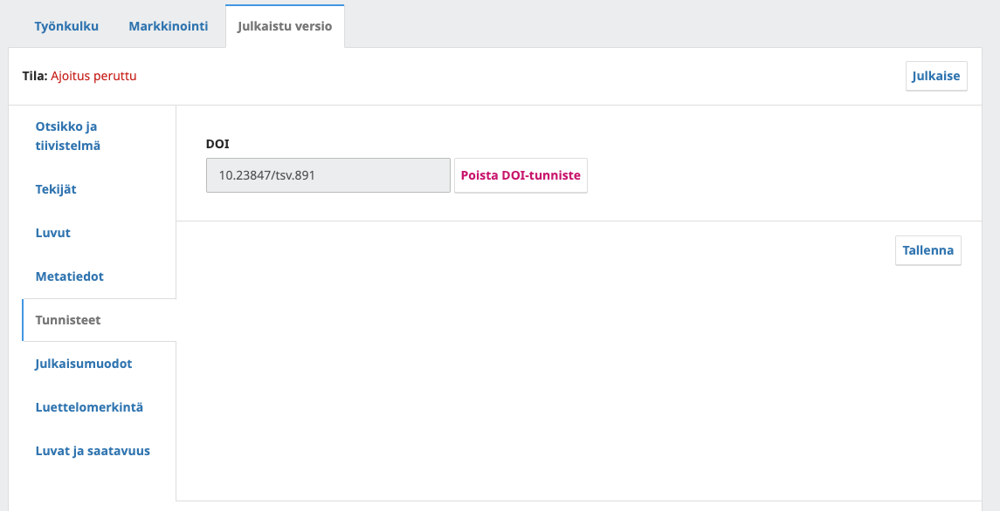
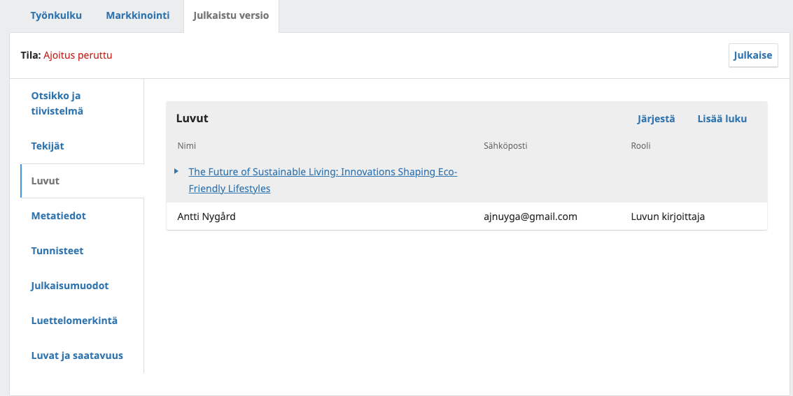
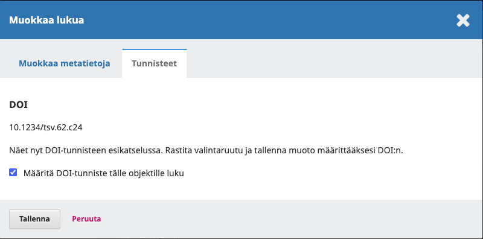
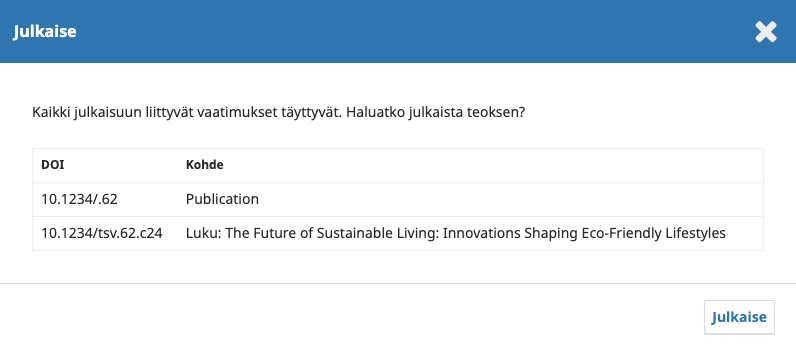

# DOI-tunnisteiden käyttö Edition.fi-palvelussa

[Yleistä tietoa DOI-tunnisteiden käytöstä ja niitä koskevista sopimuksista löydät erillisestä ohjeesta](yleiset/doi.md). Tässä ohjeessa neuvotaan DOI-tunnisteiden käyttöä Edition.fi-palvelussa ja siinä käytössä olevassa Open Monograph Press -järjestelmässä (OMP).

## Julkaisijan sivuston asetukset

Vaadittavat asetukset koskevat kolmea kokonaisuutta:

1. Julkaisijan yleiset asetukset
2. DOI-lisäosan asetukset
3. Crossref-lisäosan asetukset

### Julkaisijan yleiset asetukset

Kun uusi DOI-tunniste rekisteröidään, artikkelia koskeva metadata lähetetään tunnistetta hallinnoivalle taholle. Keskeinen osa tätä metadataa tulee julkaisijan yleisistä asetuksista.

Alla mainitut asetukset täytetään kaikilla käytössä olevilla kielillä.

**Settings > Press / Asetukset > Julkaisija**

* Julkaisijan nimi / Journal name
* Julkaisijan alkukirjaimet / Journal initials
* Julkaisijan nimi / Press Publisher Name (ONIX-tiedot, käytä pääasiallista kieliversiota)

**Settings > Press > Series / Asetukset > Julkaisija > Sarja**

* Valitse jokaisen lisätyn sarjan edestä sininen kolmio > Muokkaa ja lisää sarjan asetuksiin ISSN-tunnukset.

**Settings > Press > Contact / Asetukset > Julkaisija > Yhteystiedot**

* Pääasiallinen yhteyshenkilö (nimi ja sposti)
* Teknisen tuen yhteyshenkilö (nimi ja sposti)

**Settings => Workflow => Submission/ Asetukset => Työnkulku => Käsikirjoituksen vastaanotto**

* Kohdasta Submission Metadata / Käsikirjoituksen metatiedot valitse References / Lähdeviitteet (rasti kahteen kohtaan)
* Save / Tallenna

### DOI-lisäosan asetukset

**Settings => Website => Plugins / Asetukset => Verkkosivusto => Lisäosat**

* Hae listalta kohta DOI
* Aktivoi lisäosa klikkaamalla sen perässä oleva valintaruutua
* Klikkaa sinistä kolmiota lisäosan nimen edessä > **Settings / Asetukset**
* Avautuvaan ikkunaan täytetään seuraavat asetukset
    * Valitse objektit, joille DOI-tunnisteet määritetään: **valitaan kirjat / books, jos haluaa myös luvuille DOI-tunnuksia, niin lisäksi luvut / chapters**
    * **DOI Prefix** > _oma prefix_, joka on saatu TSV:ltä (esim. 10.1234)
    * **DOI Suffix** > Käytä oletusmuotoilua / Use default pattern
    * **ÄLÄ koskaan** paina Reassign DOIs / Määritä DOI-tunnisteet uudelleen
    * Paina **Save/Tallenna**

### CrossRef-lisäosan asetukset

CrossRef-lisäosan asetuksia varten tarvitaan TSV:ltä CrossRefin käyttäjätunnus ja salasana.

* Avaa asetukset kohdasta **Työkalut => Tuonti/Vienti => CrossRef XML / Tools > Import/Export > Crossref XML Plugin** -vientilisäosa.
* Avaa välilehti **Asetukset / Settings**
* Anna lomakkeeseen käyttäjätunnus ja salasana. Varmista ettei testirajapintaa koskeva asetus ole valittuna.
* Paina **Tallenna**.

## DOI-tunnisteiden lisääminen kirjoihin

Alla on kuvattu miten DOI-tunnus liitetään kirjan metadataan. Tämän lisäksi on aina hyvä huolehtia siitä, että tunnus liitetään myös kirjan kokotekstitiedoistoihin.

### Uusi kirja

Kun yllä kuvatut asetukset ovat kunnossa, tapahtuu DOI-tunnisteen lisääminen käsikirjoituksen tuotantovaiheessa. Siirry muokkaamaan käsikirjoituksen kuvailutietoja välilehdelle **Julkaistu versio** / **Publication**. Valitse kohta **Tunnisteet** / **Identifiers** ja liitä DOI-tunnus valitsemalla **Aseta** / **Set** > **Tallenna** / **Save**.

### DOI-tunnuksen liittäminen yksittäiseen lukuun

Jos DOI-lisäosan asetuksista on otettu käyttöön myös lukujen DOI-tunnukset, niiden luominen tapahtuu lukujen tietoja muokkaamalla.

Siirry muokkaamaan käsikirjoituksen kuvailutietoja välilehdelle **Julkaistu versio** / **Publication**. Valitse kohta **Luvut** / **Chapters** ja valitse haluttu luku.

Avautuvasta ikkunasta valitse välilehti **Tunnisteet / Identifiers**. Jos luvulla on jo DOI-tunnus, lomakkeessa näkyy punainen nappi, jolla tunnisteen voi poistaa. Jos DOI-tunnusta ei ole lisätty, näkyy alla olevan kuvakaappauksen mukainen näkymä. Painamalla **Tallenna **voit lisätä esikatseluna näkyvän DOI-tunnisteen lukuun.

### DOI-tunnisteiden tarkistaminen

Kun kirjan julkaisee, näkyy julkaisun tarkistusnäkymässä kirjalle ja mahdollisille luvuille luodut DOI-tunnukset. Tästä näkymästä voit myös nopeasti tarkistaa, jos joltain halutulta sisällöltä puuttuu tunnus. Huomaa, että kaikkiin lukuihin ei ole pakko lisätä tunnusta, jos et halua, eli puuttuvan DOI-tunnuksen voi jättää myös huomiotta.

### Vanha kirja

Mikäli DOI-tunniste liitetään jo julkaistuun kirjaan, pitää kirjan julkaisu ensin perua **Julkaistu versio** / **Publication** -välilehdeltä. Tämän jälkeen tunnus liitetään samalla tavalla kuin yllä on kuvattu ja kirja julkaistaan uudelleen.

_Jos tarkoituksena on liittää suuri määrä tunnuksia vanhoihin kirjoihin, tulee olla ensin yhteydessä TSV:n tukeen. Vanhojen artikkeleiden DOI-tunnukset ovat maksullisia._

### DOI-tunnisteen rekisteröinti

DOI-tunnisteet pitää kirjan julkaisun jälkeen vielä rekisteröidä, jotta ne alkavat toimia.

Avaa **Työkalut => Tuonti/Vienti => CrossRef XML / Tools > Import/Export > Crossref XML Plugin**.

Välilehdellä **Tallentamatta / To Deposit** näkyy kaikki kirjat, joiden DOI-tunnukset on rekisteröimättä. Paina kirjan nimen vieressä olevaa **Tallenna**-nappia ja odota. Lisäosa ilmoittaa vihreällä taustalla olevalla viestillä mikäli rekisteröinti onnistuu. Vaihtoehtoisesti voit saada virheilmoitukset, jossa kerrotaan mitä puutteita rekisteröitävän kirjan kuvailutiedoissa on.

## DOI-tunnisteet vanhoille kirjoille

Mikäli julkaisija haluaa hakea DOI-tunnisteita vanhoille kirjoille, tulee olla aina ensin yhteydessä sähköpostitse [tuki@tsv.fi](mailto:tuki@tsv.fi). Vanhojen kirjojen tunnisteita koskevista kustannuksista vastaa julkaisija itse.
