# Kirjojen julkaisu ja hallinta Edition.fi-palvelussa

Tässä ohjeessa kuvataan lyhyesti Edition.fi-palvelun Open Monograph Press -järjestelmän julkaisukäyttö **pikajulkaisulisäosalla (Quicksubmit plugin)**.

Pikajulkaisulisäosalla kirjoja voi joko julkaista välittömästi tai lisätä järjestelmään myöhäisempää julkaisua varten. Kirjan kuvailutiedot sekä julkaistavat tiedostot täytetään yhteen lomakkeeseen. Suuria kirjamääriä varten toteutetaan [vastaava tuontitoiminto kuin OJS-järjestelmän kohdalla](../yleiset/tuonnit.md).

Mikäli julkaisija aikoo käyttää järjestelmää uusien käsikirjoitusten vastaanottoon ja arviointiin, voi tätä varten varata erillisen koulutuksen TSV:ltä.

## Ennen julkaisua tarkistettavat asetukset

Ennen kirjojen lisäämistä tulee tarkistaa, että julkaisemiseen vaadittavat asetukset ovat oikein.

Tarkista kohdasta **Asetukset > Julkaisija** / **Settings > Press / Inställningar > Press**, että julkaisijan nimi on täytetty molempiin asetuksissa näkyviin kohtiin. Myös muut sivun asetukset on hyvä täyttää.

Tarkista kohdasta **Asetukset > Yhteystiedot** / **Settings > Contact / Inställningar > Kontakt**, että pääasiallinen yhteyshenkilö sekä teknisen tuen yhteyshenkilö on täytetty. Anna teknisen tuen yhteyshenkilöksi jokin julkaisijan oma osoite.

Lisää kohtaan **Asetukset > Sarjat** / **Settings > Series / Inställningar > Serier** kaikki ne julkaisusarjat, joihin olet lisäämässä kirjoja. Anna sarjoista aina ISSN-tunnus.

Tarkista kohdasta **Asetukset > Jakelu > Lisenssi** / **Settings > Distribution > License / Inställningar > Distribution > Licens**, että tekijänoikeutta ja lisenssiä koskevat asetukset ovat oikein. Nämä ovat asetukset, joita järjestelmä ehdottaa oletuksena lisättäville kirjoille, mutta lisenssitietoja voidaan muokata aina kirjakohtaisesti julkaisemisen yhteydessä.

Tarkista kohdasta **Asetukset > Työnkulku > Käsikirjoituksen vastaanotto > Metatiedot** / **Settings > Workflow > Submission > Metadata / Inställningar > Arbetsflöde > Bidrag > Metadata**, että kuvailutietojen keräämistä koskevat asetukset ovat oikein. Julkaisija voi itse päättää mitä kuvailutietoja se haluaa kirjoihin lisätä. Suositeltavia ovat ainakin **Avainsanat / Keywords / Nyckelord** sekä **Tieteenalat / Disciplines / Disciplin(er)**.

Kohdasta **Asetukset > Verkkosivusto > Asetukset** > **Kielet / Settings > Website > Setup > Languages / Inställningar > Webbplats > Inställning > Språk** tarkista sivuston kieliasetukset. Asetukset riippuvat siitä millä kielellä kirjoja julkaistaan. Jos julkaisija julkaisee esimerkiksi suomeksi ja englanniksi, valitse kaikki kolme valintaruutua kummankin kielen kohdalta.

**Käyttöliittymä/UI/Gränssnitt**-kohdasta voidaan hallita mitä kieliä käyttäjä voi valita selatessaan sivustoa. Kohdasta **Lomakkeet/Forms/Formulär** valitaan ne kielet, joilla asetuksia ja kirjojen kuvailutietoja voidaan täyttää. Kohdasta **Käsikirjoitukset/Submission/Skicka in bidrag** valitaan minkä kielisiä kirjoja on tarkoitus julkaista. Mikäli valitsee kohtaan käsikirjoitukset jonkin kielen, tulee aina valita myös vastaavan kielen osalta kohta Lomakkeet.

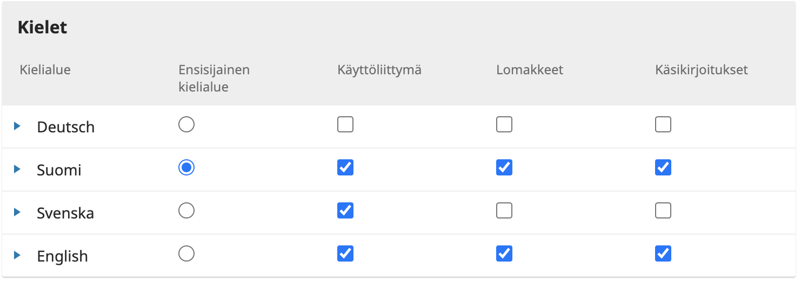

**HUOM! Näiden asetusten lisäksi kannattaa tutustua myös järjestelmän muihin asetuksiin:** [https://docs.pkp.sfu.ca/learning-omp/3.2/press-setup](https://docs.pkp.sfu.ca/learning-omp/3.2/press-setup)

## Pikajulkaisulisäosan käyttö

### Valmistelu

Ennen kirjan lisäämistä nimeä lisättävät tiedostot helposti tunnistettavalla tavalla ja tallenna ne hakemistoon, josta löydät ne helposti. Kaikkien kirjojen tiedostot kannattaa nimetä samalla logiikalla.

Koko kirjaa koskevassa tiedostossa voi käyttää nimenä esimerkiksi muotoa _kirjoittajansukunimi-julkaisuvuosi.pdf _eli_ nygård-2021.pdf_. Jos olet lisäämässä myös yksittäisiä lukuja koskevia tiedostoja, voit nimetä ne esimerkiksi _kirjoittajannimi-luku-julkaisuvuosi.pdf_ eli _nygård-luku1-2021.pdf_. 

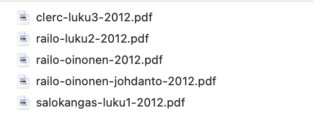

### Kirjan lisääminen

Aloita kirjan lisääminen valitsemalla **Työkalut > Tuonti / Vienti** **> OMP-pikajulkaisulisäosa** / **Tools > Import/Export > OMP QuickSubmit Plugin / Verktyg > Importera/Exportera > quickSubmit **

Täytä tiedot järjestyksessä ylhäältä alas.

**Kansikuva/Cover Image/Omslag.** Voit halutessasi lisätä kirjalle kansikuvan. Muista aina täyttää tässä yhteydessä annettava vaihtoehtoinen teksti. Kenttään voi antaa kirjan nimen. Kuvatiedosto tulee olla joko png- tai jpg-muodossa. Hyvä enimmäiskoko on esimerkiksi 1200 pikselin korkeus ja vähintään kuva tulee olla 250 pikselin korkuinen.

**Käsikirjoituksen kieli/Submission Language/Bidragets språk**. Mikäli kieliasetuksiin on annettu useampia julkaisukieliä, voit valita minkä kielisen kirjan olet lisäämässä. Valinta on tärkeä, koska se vaikuttaa siihen millä kielellä kuvailutiedot vaaditaan. Mikäli julkaisija käyttää vain yhtä kieltä, tätä valintaa ei ole näkyvissä.

**Käsikirjoitustyyppi/Submission Type/Typ av bidrag**. Valitse onko kirja monografia (erillisteos) vai toimitettu teos. 

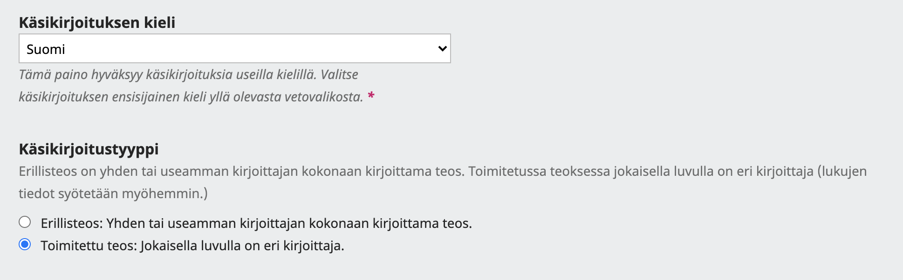

**Prefiksi, otsikko, alaotsikko ja abstrakti / Prefix, Title, Subtitle, Abstract / Prefix, titel, undertitel och abstrakt**. Anna tähän kirjan otsikkotiedot sekä tiivistelmä. Prefiksi koskee vain sellaisia kieliä, joissa otsikko voi alkaa jollain artikkelilla, esim. “the”. Näissä kielissä artikkelin voi halutessaan erotella erilliseen kenttään.

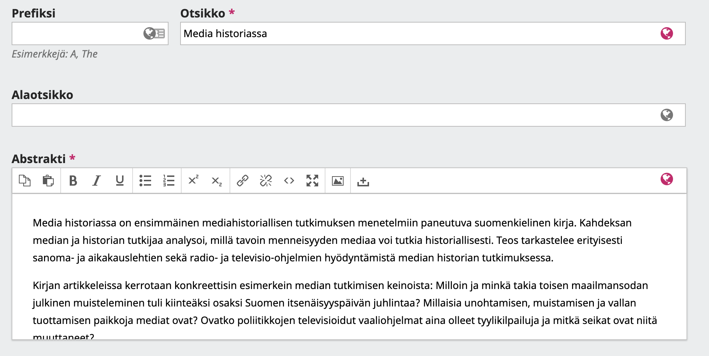

**Lisätarkennuksia/Additional Refinements/Ytterligare information.** Tähän kohtaan täytettävät tiedot riippuvat julkaisijan omista asetuksista. Täytettäviä kenttiä voivat olla esimerkiksi kirjaan liittyvät avainsanat ja tieteenalat.

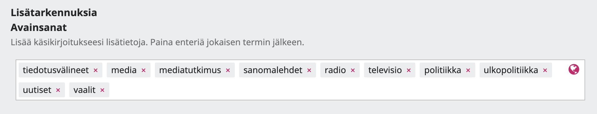

Lisää kirjan **tekijäluettelo/List of Contributors/Lista över medarbetare**. Tähän lisätään monografian kohdalla kirjoittajat sekä toimitetun teoksen kohdalla toimittajat ja lukujen kirjoittajat.

* Valitse **Lisää tekijä/Add contributor/Lägg till medarbetare**
* Täytä avautuvaan lomakkeeseen kirjoittajan **nimi**, **sähköposti**, **maa** sekä **affiliaatio**. Mikäli et tiedä sähköpostiosoitetta, kannattaa käyttää oman toimituskunnan pääasiallista sähköpostia. Osoitetta ei julkaista kirjoittajan nimen yhteydessä.
* Valitse tekijän **rooli/role**. Monografian kohdalla yleensä _Kirjoittaja/Author_. Toimitetun teoksen kohdalla _Teoksen toimittaja/Volume Editor_ tai _Luvun kirjoittaja/Chapter author_.
* Paina **Tallenna/Save/Spara**
* Mikäli tekijöitä on useita, aloita uudelleen valitsemalla **Lisää tekijä/Add contributor/Lägg till medarbetare**.

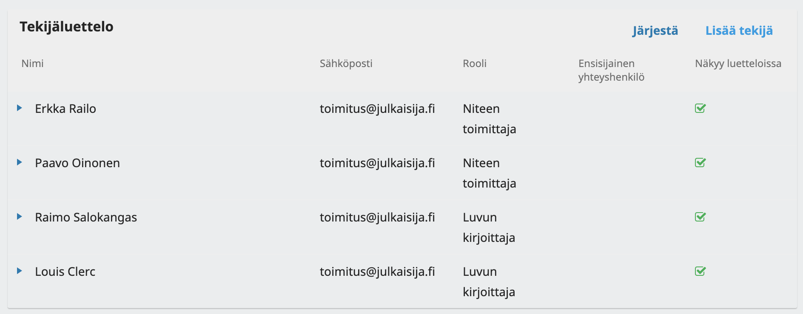

**Julkaisumuodot/Publication Formats/Publikationsformat**. Julkaisumuotoja voi olla esimerkiksi PDF tai HTML. _Yhteen julkaisumuotoon voi liittyä useita tiedostoja_. Esimerkiksi PDF-muotoiseen julkaisumuotoon voi sisältyä kirjan kokoteksti sekä yksittäisten lukujen kokotekstit.

* Valitse **Lisää julkaisumuoto/Add publication format/Lägg till publikationsformat**
* Kohtaan **Muodon tiedot/Format details/Formatdetaljer** annetaan tiedostotyyppi, esim. “PDF”. 
* Lisää kohtaan **ISBN** kirjan ISBN-13 tai ISBN-10 tunniste sille tarkoitettuun kenttään.
* Paina lopuksi **OK**.
* Kun julkaisumuoto on lisätty, voit lisätä siihen tiedostoja valitsemalla julkaisumuodon alta kohdan **Vaihda tiedosto/Change File/Byt fil**.
* Valitse **Kirjan osa/Submission component/Bidragets komponent**. Kirjan kokotekstin tapauksessa se on **Kirjan käsikirjoitus/Book manuscript/Bokmanuskript**. Yksittäisen luvun tapauksessa **Luvun käsikirjoitus/Chapter manuscript/Kapitelmanuskript**.
* Valitse **Lataa tiedosto/Upload File/Ladda upp fil** ja hae haluttu tiedosto tietokoneeltasi.
* Vihreä V-kirjain tiedoston nimen edessä on viesti onnistuneesta latauksesta.
* Paina **Jatka/Continue/Fortsätt**. Kohdassa 2 ei ole tarvetta nimetä tiedostoa uudelleen, paina **Jatka/Continue/Fortsätt** ja lopuksi vaiheessa 3 **Suorita/Complete/Slutför.**
* Mikäli haluat lisätä muita tiedostoja samaan julkaisumuotoon, aloita uudelleen valitsemalla **Vaihda tiedosto/Change file/Byt fil.**

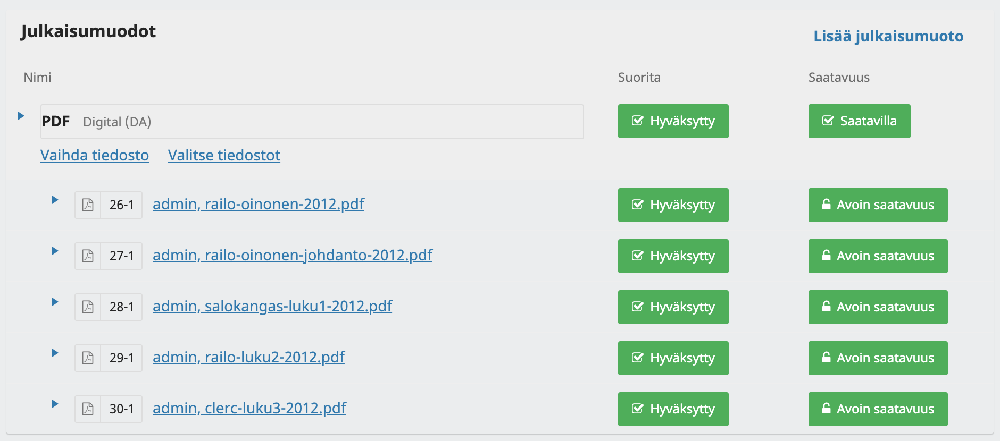

Voit lisätä myös linkin verkkokauppaan, joka myy painettua kirjaa tai esimerkiksi print-on-demand-palveluun. Tämä tapahtuu lisäämällä painettua kirjaa koskeva erillinen julkaisumuoto.

* Valitse **Lisää julkaisumuoto/Add publication format/Lägg till publikationsformat**
* **Muodon tiedot/Format details/Formatdetaljer** kohtaan nimeksi esimerkiksi “Painettu kirja” tai “Hardback” ja tyypiksi vieressä olevasta vetovalikosta **Hardback** tai **Paperback**. Lisäksi valitse kohta **Fyysinen muoto/Physical format**.
* Valitse kohta “Tämä muoto tulee saataville erilliselle verkkosivustolle / This format will be available at a separate website / Detta format är tillgängligt på en separat webbsida” ja anna kirjan myyntisivulle johtava linkki kohtaan **URL-polku/URL Path/URL-sökväg**.
* Lisää kohtaan **ISBN** kirjan ISBN-13 tai ISBN-10 tunniste sille tarkoitettuun kenttään.
* Paina lopuksi **OK**

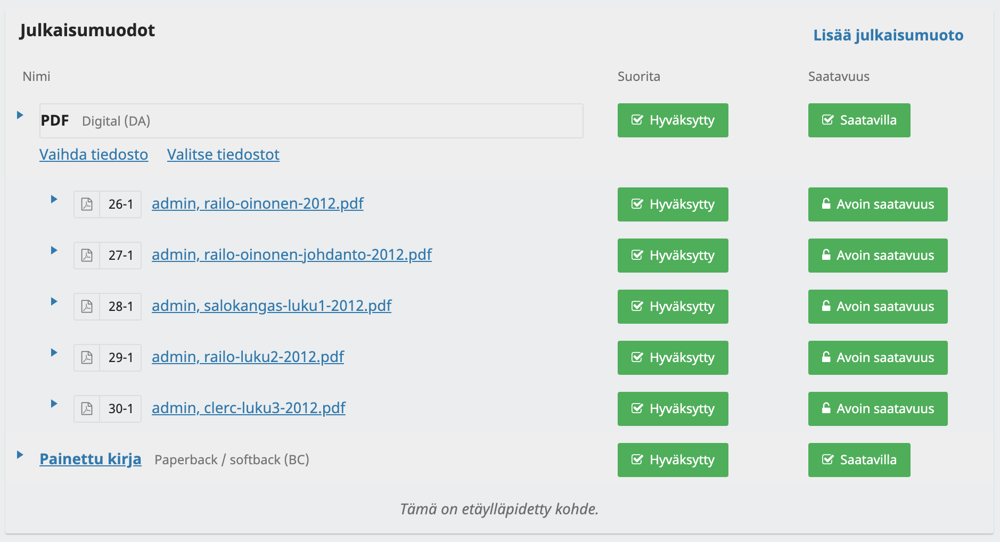

**Luvut/Chapters/Kapitel**. Kirjan luvut voi halutessaan eritellä kuvailutietoihin. 

* Valitse **Lisää luku/Add Chapter/Lägg till kapitel**
* Anna luvun otsikko sekä mahdollinen alaotsikko, abstrakti ja sivunumerot.
* Kohdasta **Lisää tekijä/Add Contributor/Lägg till medarbetare** voi valita lukua koskevat kirjoittajat. Tässä näkyvät kaikki tekijäluetteloon lisätyt nimet.
* Kohdasta **Tiedostot/Files/Filer** voit valita lukua koskevat kokotekstitiedostot. Niiden pitää olla lisättynä julkaisumuodon yhteyteen.
* Paina lopuksi **Tallenna/Save/Spara**
* Toista kaikkien lukujen kohdalla.

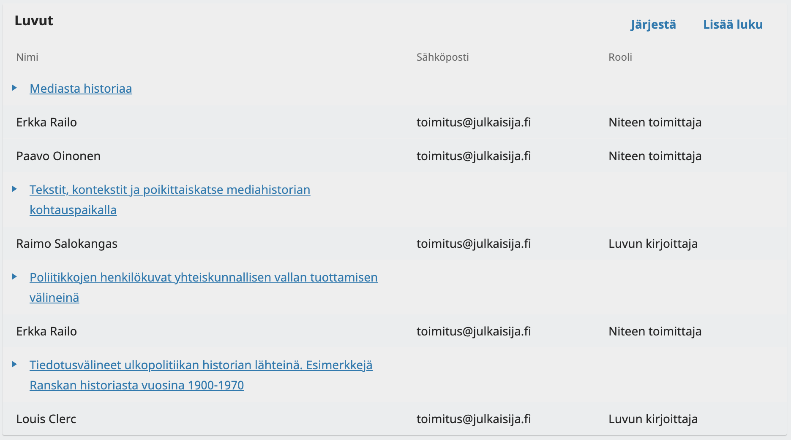

**DOI-tunnukset.** Mikäli julkaisijalla on käytössä DOI-tunnukset ja niitä koskevat asetukset on annettu järjestelmään, lomakkeessa näkyy kohta, josta voi luoda tunnukset kirjalle ja luvuille.

**Lisenssin URL-osoite/License URL/Licens-URL**. Anna tähän lisenssi, jolla kirja on julkaistu. Käytän nimeomaan URL-osoitetta, esimerkiksi [https://creativecommons.org/licenses/by/4.0/](https://creativecommons.org/licenses/by/4.0/). Jos olet täyttänyt lisenssiä koskevat julkaisijan asetukset, järjestelmä ehdottaa tähän asetusten mukaista lisenssiä.

**Tekijänoikeuden haltija/Copyright Holder/Upphovsrättsinnehavare**. Järjestelmä ehdottaa tähän julkaisijan oletusasetusta, mutta valinnan voi myös vaihtaa kirjakohtaisesti.

**Lopuksi** valitaan onko kirja välittömästi julkaistu vai lähetetäänkö se vain julkaisuvalmiiksi tuotantovaiheeseen. Jos kirja halutaan julkaista heti, pitää antaa vielä julkaisuaika. 

Tässä käytetään **kirjan alkuperäistä julkaisuajankohtaa**, jos kyse on digitoidusta teoksesta. Ajan voi kirjoittaa suoraan käsin muotoon vvvv-kk-pp, esimerkiksi _2002-05-24_. Jos tarkkaa julkaisuajankohtaa ei tiedetä, käytä muotoa _1960-01-01_, eli julkaisuvuoden ensimmäinen päivä.

Paina lopuksi **Tallenna/Save/Spara**. Kun kirja on lisätty, voit siirtyä lisäämään uuden tai pääset katsomaan lisättyä kirjaa.

## Julkaisun jälkeen

### DOI-tunnusten rekisteröinti

DOI-tunnusten käyttö Edition.fi-palvelussa vaatii tunnusten käyttöä koskevan sopimuksen. Jos tunnukset ovat käytössä, uuden kirjan DOI-tunnukset voi rekisteröidä heti sen julkaisun jälkeen.

Rekisteröinti tapahtuu kohdasta **Työkalut > Tuonti/Vienti > Crossref XML -vientilisäosa / Tools > Import/Export > Crossref XML Plugin / Verktyg > Importera/Exportera > crossref.** Avautuvalta sivulta näkyy ensimmäisellä välilehdellä kirjat, joiden tunnuksia ei ole rekisteröity ja toisella välilehdellä jo rekisteröidyt kirjat. Rekisteröinti tapahtuu klikkaamalla kirjan nimen perässä oleva rekisteröintilinkkiä.

### Kirjojen muokkaaminen

Lisätyt kirjat löytyvät kohdasta **Käsikirjoitukset/Submissions/Bidrag**. Julkaistut kirjat ovat välilehdelleä **Arkisto/Archive/Arkiv** ja tuotantovaiheeseen lähetetyt julkaisemattomat välilehdellä **Kaikki aktiiviset/All active/Alla aktiva**.

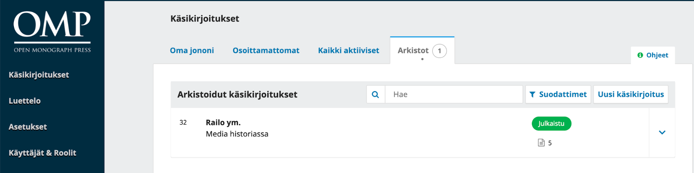

Kirjaa pääsee muokkaamaan klikkaamalla sen otsikkoa ja siitä avautuu kirjan/käsikirjoituksen työnkulku, joka on tässä tapauksessa tuotantovaiheessa.

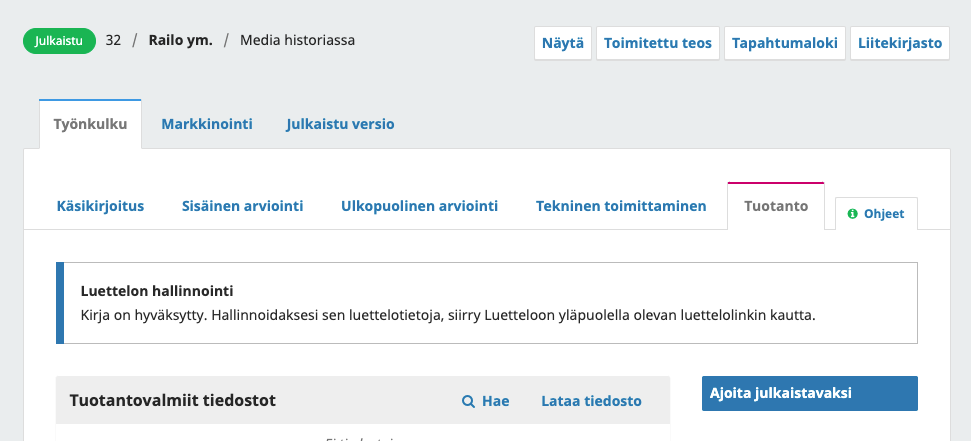

Välilehdeltä **Julkaistu versio / Publication** **/ Publikation** löytyy kaikki kirjan julkiset tiedot sekä toiminnot sen julkaisemiseen ja/tai julkaisun perumiseen.

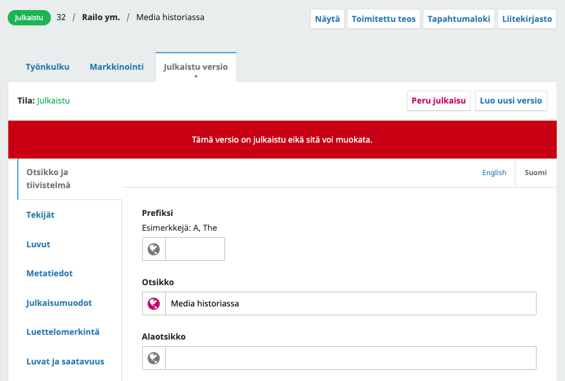

OMP ja OJS järjestelmien uusin versio tukee versiointia. Eli samasta kirjasta voi olla julkaistuna useita eri versioita. Näitä _uusia versioita tulee kuitenkin luoda harkitusti_ ja vanhan digitoidun teoksen kohdalla tämän ei pitäisi olla koskaan tarpeellista.

_Mikäli jo julkaistun kirjan kuvailutietoihin halutaan tehdä jokin pieni korjaus, ei tätä varten pidä luoda uutta versiota_. Näissä tapauksissa voidaan valita yllä olevasta näkymästä **Peru julkaisu**, jonka jälkeen kuvailutietoja pääsee muokkaamaan. Muokkaamisen jälkeen kirjan voi julkaista uudelleen.

### Luettelon hallinta

Kohdasta **Asetukset > Verkkosivusto > Ulkoasu > Asetukset / Settings > Website > Appearance > Setup / Inställningar > Webbplats > Utseende > Inställning** voi valita mitä julkaisijan etusivulla näkyy. Lomakkeen alaosassa on toiminnot, joilla voi aktivoida **Nostot/Spotlight**, **Esittelyssä olevat/Featured** sekä **Uutuudet/New releases/Nya utgivningar**. Nämä ovat erilaisia valinnaisia näkymiä julkaisijan kirjaluetteloon. Järjestelmä luo automaattisesti näkymät koko luetteloon sekä sarjakohtaiseen luetteloon. Lisäksi **Sivupalkki/Sidebar/Sidomeny** -listasta kannattaa aktivoida **Selauslohko/Browse Block/Bläddra-block**, joka lisää sivupalkkiin linkit mm. julkaisusarjojen sivuille.

Luettelossa olevat _julkaistut_ kirjat näkyvät kohdassa **Luettelo/Catalog/Katalog**. Sivulla näkyvästä listasta voi valita kirjoja uutuusluetteloon sekä esittelyssä oleviin kirjoihin. Välilehdeltä **Nostot/Spotlights** voi lisätä tiettyjä kirjoja nostoihin. Nosto on käytännössä lyhyt kirjaa koskeva mainos, jossa valitaan mainostettava kirja ja annetaan mainostettavalle kirjalle otsikko ja kuvaus.

Erilaisia etusivun selausvaihtoehtoja kannattaa testata vaihtamalla asetuksia.
