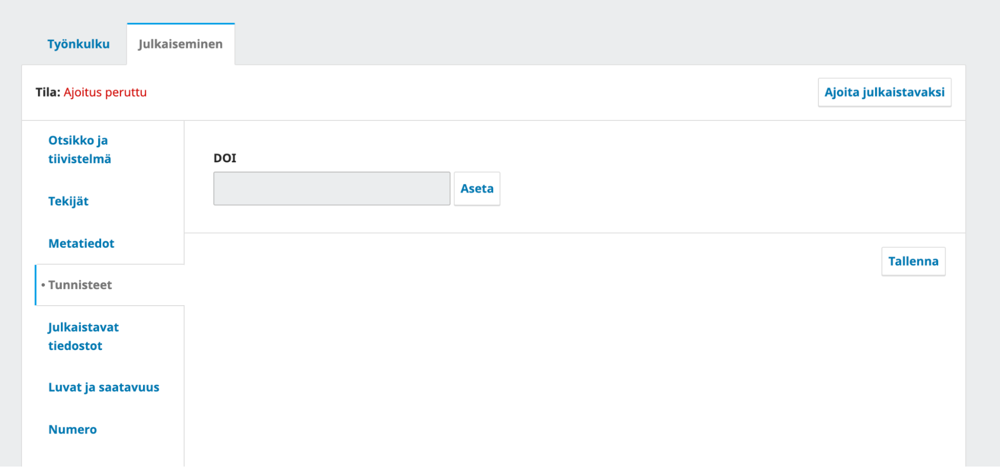

# DOI-tunnisteiden käyttö Journal.fi-palvelussa

[Yleistä tietoa DOI-tunnisteiden käytöstä ja niitä koskevista sopimuksista löydät erillisestä ohjeesta](yleiset/doi.md). Tässä ohjeessa neuvotaan DOI-tunnisteiden käyttöä Journal.fi-palvelussa ja siinä käytössä olevassa Open Journal Systems -järjestelmässä (OJS).

## Lehden asetukset

Vaadittavat asetukset koskevat kolmea kokonaisuutta:

1. Lehden yleiset asetukset
2. DOI-lisäosan asetukset
3. CrossRef-lisäosan asetukset (mikäli käytetään Crossrefin palveluita)

### Lehden yleiset asetukset

Kun uusi DOI-tunniste rekisteröidään, artikkelia koskeva metadata lähetetään tunnistetta hallinnoivalle taholle. Keskeinen osa tätä metadataa tulee lehden yleisistä asetuksista.

Alla mainitut asetukset täytetään kaikilla käytössä olevilla kielillä.

**Settings => Journal / Asetukset => Julkaisu**

* Julkaisun nimi / Journal name
* Julkaisun alkukirjaimet / Journal initials
* Julkaisun lyhenne / Journal abbreviation
* Julkaisija / Publisher
* ISSN (yksi tai molemmat)

**Settings => Journal => Contact / Asetukset => Julkaisu => Yhteystiedot**

* Pääasiallinen yhteyshenkilö (nimi ja sposti)
* Teknisen tuen yhteyshenkilö (nimi ja sposti)

**Settings => Workflow => Submission/ Asetukset => Työnkulku => Käsikirjoituksen vastaanotto**

* Kohdasta Submission Metadata / Käsikirjoituksen metatiedot valitse References / Lähdeviitteet (rasti kahteen kohtaan)
* Save / Tallenna

### DOI-lisäosan asetukset

**Settings => Website => Plugins / Asetukset => Verkkosivusto => Lisäosat**

* Listalta kohta DOI
* Aktivoi lisäosa klikkaamalla sen perässä oleva valintalaatikkoa
* Klikkaa sinistä kolmiota nimen edessä => Settings / Asetukset
* Avautuvaan ikkunaan täytetään asetukset
* Journal content / Julkaisun sisältö => **valitaan vain kohta Articles / Artikkelit**
* DOI Prefix => _oma prefix_, joka on saatu TSV:ltä (esim. 10.1234)
* DOI Suffix => ”Use pattern” / “Käytä muotoilua” => for articles / artikkeleille => **%j.%a**
    * Muuttuja %j on asetuksissa annettu lehden lyhenne. Varmista, että lyhenteessä on käytetty vain kirjaimia, eli ei erikoismerkkejä kuten &. 
* **ÄLÄ koskaan** paina Reassign DOIs / Määritä DOI-tunnisteet uudelleen
* Paina Save / Tallenna

### CrossRef-lisäosan asetukset

Viimeisenä laitetaan kuntoon CrossRef-lisäosan asetukset. Tätä varten tarvitaan TSV:ltä lehden CrossRefin käyttäjätunnus ja salasana.

Avaa asetukset kohdasta **Työkalut => Tuonti/Vienti => CrossRef XML -vientilisäosa**.

Anna tallettajan nimi ja sähköpostiosoite. Käytä mahdollisuuksien mukaan jotain harvoin vaihtuvaa osoitetta.

Anna lomakkeen seuraavaan kohtaan käyttäjätunnus ja salasana.

Valitse lopuksi DOI-tunnisteiden automaattinen tallennus ja varmista, ettei testirajapinta ole valittuna. 

Paina “Tallenna”.

## DOI-tunnisteiden lisääminen artikkeleihin

### Uusi artikkeli

Kun yllä kuvatut asetukset ovat kunnossa, tapahtuu DOI-tunnisteen lisääminen käsikirjoituksen tuotantovaiheessa. Siirry muokkaamaan käsikirjoituksen kuvailutietoja välilehdelle **Julkaiseminen** / **Publication**. Valitse kohta **Tunnisteet** / **Identifiers** ja liitä DOI-tunnus valitsemalla **Aseta** / **Set** > **Tallenna** / **Save**.

### Vanha artikkeli

Mikäli DOI-tunniste liitetään jo julkaistuun artikkeliin, pitää artikkelin julkaisu ensin perua **Julkaiseminen** / **Publication** -välilehdeltä. Tämän jälkeen tunnus liitetään samalla tavalla kuin yllä on kuvattu ja artikkeli julkaistaan uudelleen.

Jos tarkoituksena on liittää suuri määrä tunnuksia vanhoihin artikkeleihin, tulee olla ensin yhteydessä TSV:n tukeen. Vanhojen artikkeleiden DOI-tunnukset ovat maksullisia.

### DOI-tunnisteen rekisteröinti

Mikäli CrossRef-lisäosan asetukset on täytetty yllä olevien ohjeiden mukaisesti, OJS rekisteröi DOI-tunnisteet automaattisesti numeron julkaisun jälkeen. Rekisteröinnissä on aina 1-24 tunnin viive.

Vaihtoehtoisesti tunnisteet voi rekisteröidä heti numeron julkaisun jälkeen manuaalisesti kohdasta **Tools => Import/Export => CrossRef XML Export Plugin => Articles **/ **Työkalut => Tuonti/Vienti => CrossRef XML -vientilisäosa => Artikkelit**. \
Avautuvalla sivulla on listattuna kaikki lehden artikkelit, joilla on DOI-tunniste. Artikkelin nimen perässä näkyy kyseisen artikkelin rekisteröinnin tila ja näkymää voi rajata valitsemalla “Hae”. Manuaalinen rekisteröinti tapahtuu valitsemalla haluttujen artikkeleiden valintaruutu ja klikkaamalla nappia **Rekisteröi/Register**. _Crossrefin rajapinnan vastaus kestää jonkin aikaa, eli tässä pitää olla kärsivällinen._

## DOI-tunnisteet vanhoille artikkeleille

Mikäli lehti haluaa hakea DOI-tunnisteita vanhoille artikkeleille ja on mukana TSV:n solmimassa sopimuksessa, tulee lehden olla aina ensin yhteydessä sähköpostitse [ojs@tsv.fi](mailto:ojs@tsv.fi). Vanhojen artikkeleiden tunnisteita koskevista kustannuksista vastaa lehti itse.
