# Artikkeleiden ennakkojulkaisu ja Journal.fi

OJS-järjestelmään on saatavissa lisäosa, jolla voi julkaista artikkeleita ennakkoon, eli ennen kuin varsinainen numero on julkaistu.

## Tulevat artikkelit / Forthcoming -lisäosan käyttöönotto

1. Siirry numeroiden hallintaan ja luo uusi numero. Anna numerolle erottuva nimi, esimerkiksi ”Tulevat artikkelit”. Numeron asetuksissa kannattaa siis antaa pelkkä otsikko ja jättää muut tiedot (numero, vol.) pois. Rastita täytettäviksi kentiksi pelkästään Otsikko.

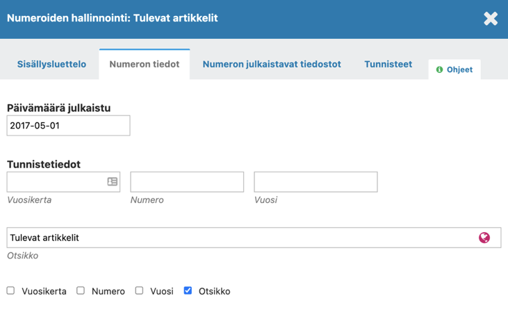

Julkaise Forthcoming-numero. Muista jättää numeron julkaisun yhteydessä lehden käyttäjille menevä ilmoitus pois.

Tässä yhteydessä järjestelmä merkitsee numeron uusimmaksi, mutta voit palauttaa oikean uusimman numeron klikkaamalla sinistä kolmiota oikean numeron kohdalta ja sieltä edelleen **Uusin numero / Current issue**.

2. Siirry **Asetukset > Verkkosivusto > Lisäosat / Settings > Website > Plugins**.

Ota Forthcoming-lisäosa käyttöön aktivoimalla sen perässä oleva valintaruutu. Tämän jälkeen klikkaa sinistä kolmiota lisäosan nimen edestä ja avaa lisäosan asetukset.

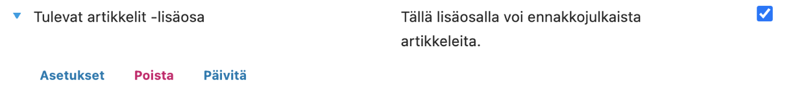

Valitse asetuksissa näkyvästä luettelosta lisäämäsi Forthcoming-numero ja tallenna asetukset painamalla OK.

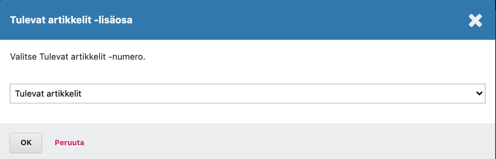

3. Siirry **Asetukset > Verkkosivusto > Asetukset > Navigaatiovalikot / Settings > Website > Setup > Navigation**.

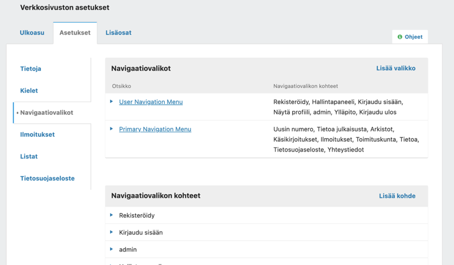

Lisää pääasialliseen navigaatiovalikkoon linkki, joka johtaa osoitteeseen *lehden_nimi/forthcoming*. Esimerkiksi[ https://journal.fi/lehti/fortchoming](https://journal.fi/lehti/fortchoming).

Aloita valitsemalla **Lisää kohde**. Anna linkin otsikko (näkyy navigointipalkissa), valitse tyypiksi **Ulkoinen URL** ja anna lopuksi **URL-** kohtaan Forthcoming-sivulle johtava osoite.

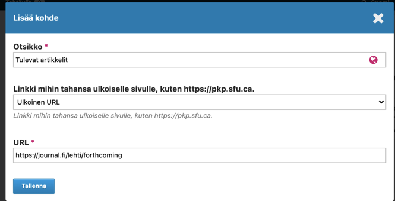
 
Klikkaa tämän jälkeen navigaatiovalikkojen listassa olevaa pääasiallista navigaatiovalikkoa (primary). Vedä lisätty uusi kohde navigaatiovalikkoon haluttuun kohtaan ja tallenna.

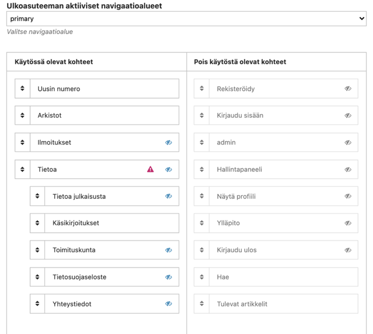
 
Lisäosan asetukset ovat nyt valmiit.

## Artikkelin ennakkojulkaisu

Kun haluat ennakkojulkaista artikkelin, siirry normaalisti julkaisemaan artikkelia **Ajoita julkaistavaksi / Schedule for publication**.

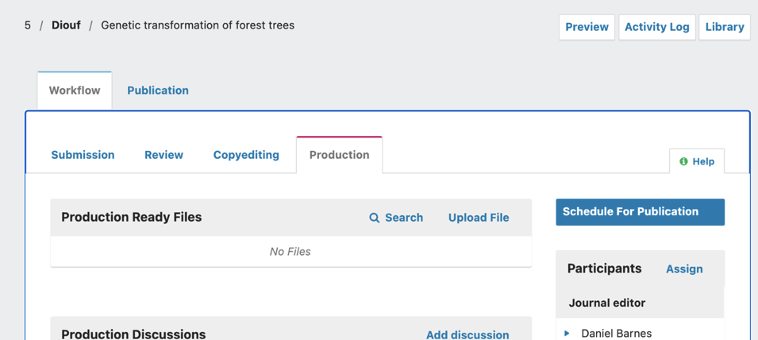

Lisää tarvittaessa DOI-tunnus, kohdasta tunnisteet. Muista tallentaa asetus.

Valitse kohdasta **Issue / Numero** numeroksi tulevien artikkeleiden numero **Assign to issue / Lisää numeroon**.

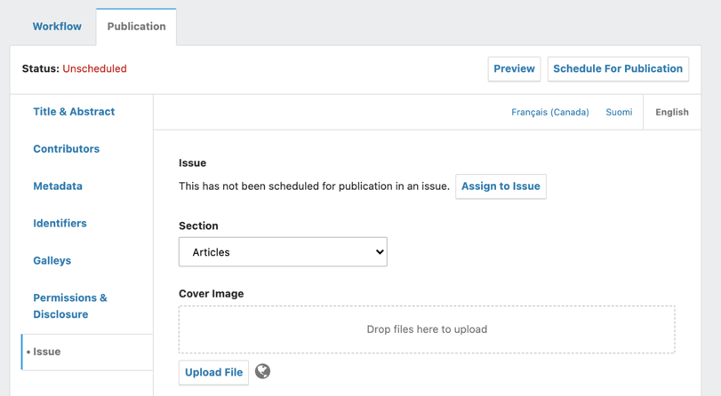

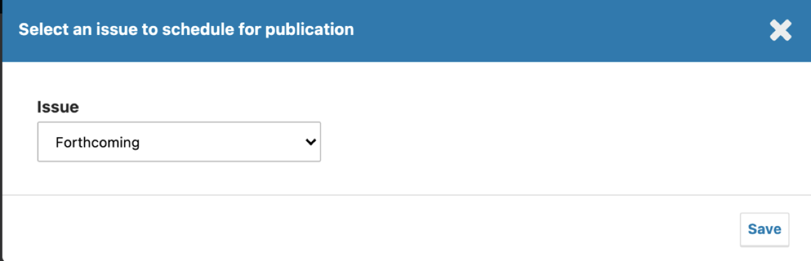

**Koska numero on jo julkaistu, artikkelista tulee heti julkinen ja se alkaa näkyä tulevien artikkeleiden listauksessa.**

Voit jo tässä vaiheessa luoda artikkelista suoraan uuden version ja liittää sen siihen tulevaan numeroon, jossa artikkelin on tarkoitus ilmestyä. Tällä tavalla artikkeli ilmestyy automaattisesti numeron julkaisun yhteydessä sen sisällysluettelossa ja poistuu tulevien artikkeleiden listalta.

Valitse **Uusi versio / Create New Version**. Näkymän yläosaan ilmestyy uuden version lisäämisen jälkeen valikko, josta voi siirtyä versioiden välillä.

Ennakkojulkaistu artikkeli näkyy verkkosivujen listauksessa ja myös sen abstraksisivulle pääsee normaalisti.

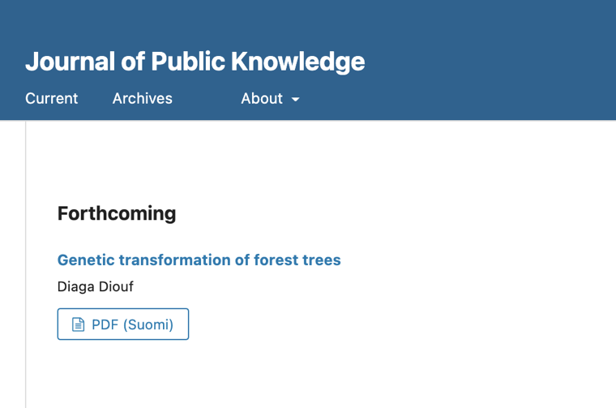

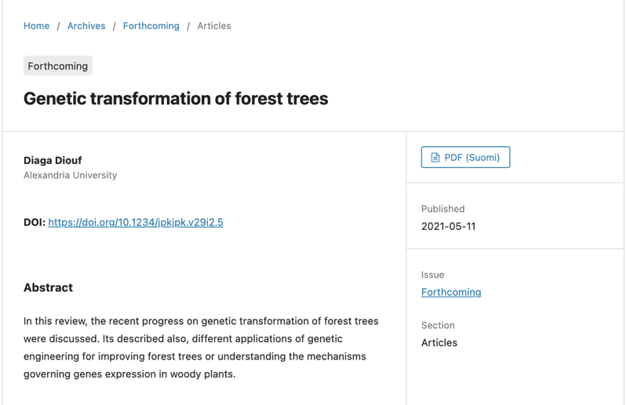

 

 

 
