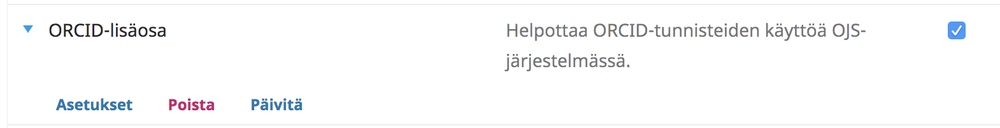
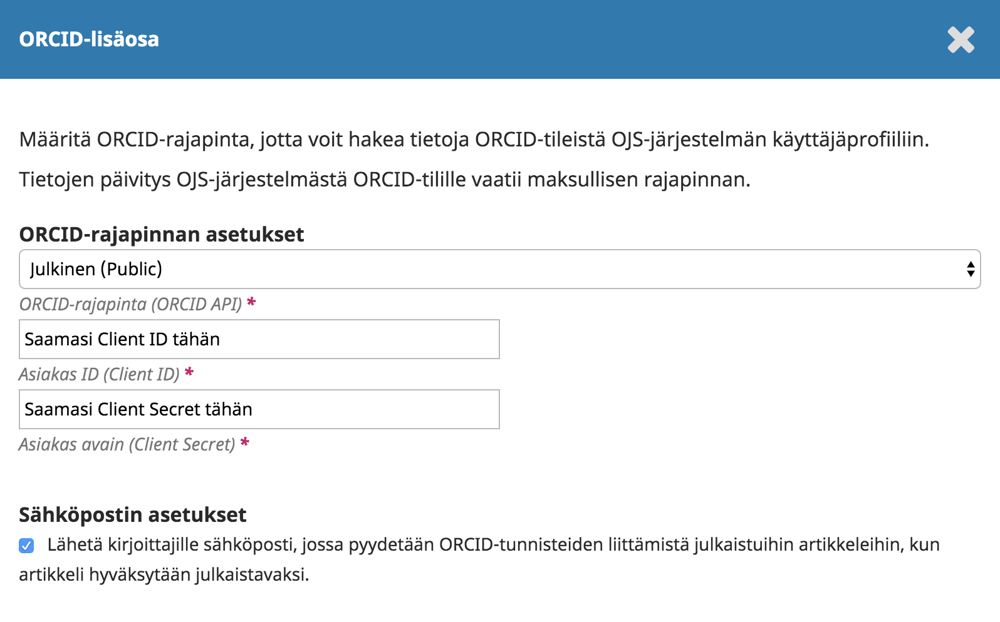
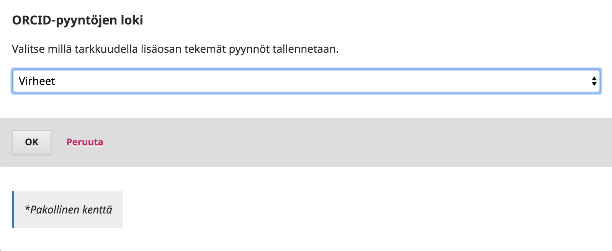
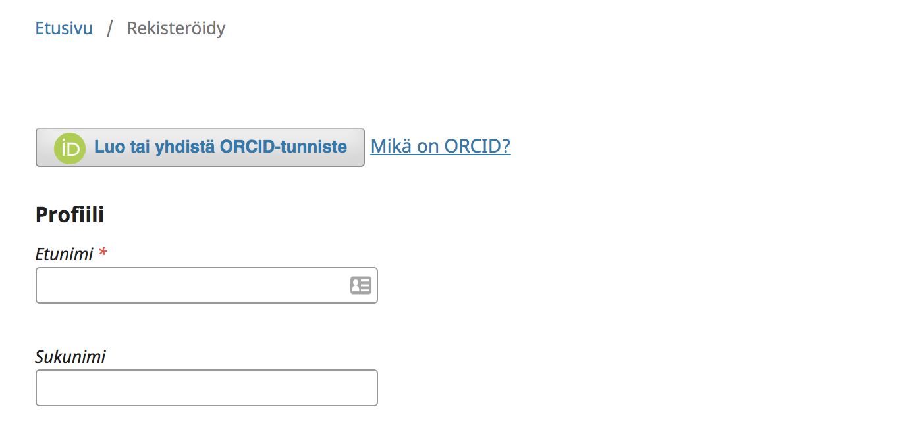
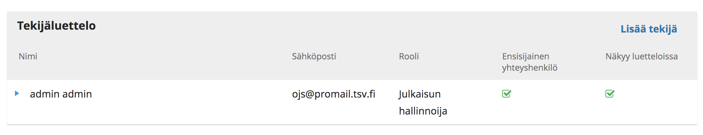
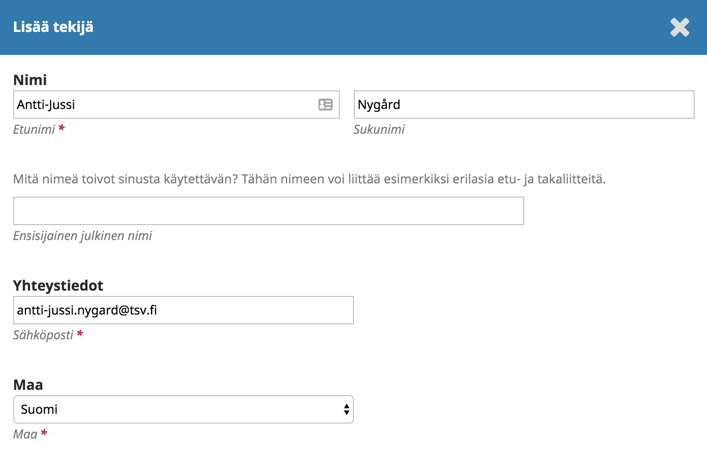
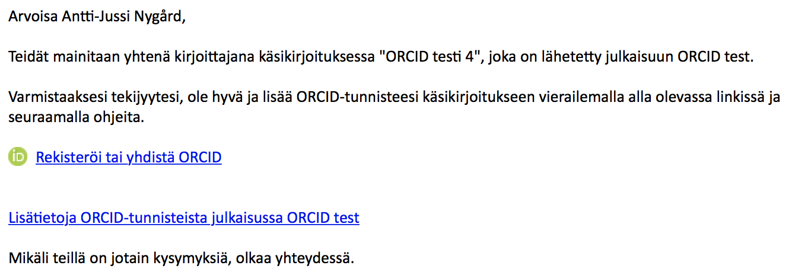
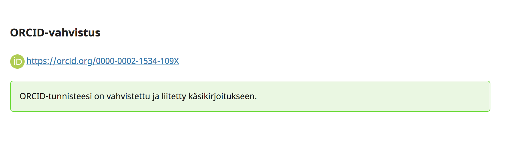
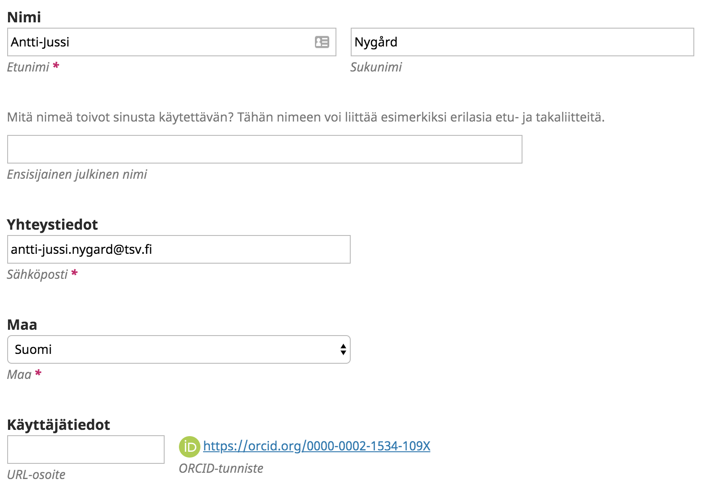
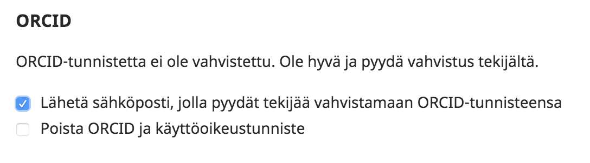

# ORCID-tunnisteiden käyttö Journal.fi-palvelussa

## ORCID-tunnisteet OJS-järjestelmässä

OJS-järjestelmässä on mahdollista ottaa käyttöön ORCID-lisäosa. Mikäli ORCID-lisäosa ei ole päällä, ORCID-tunnisteet syötetään kirjoittajan tiedoissa avoimeen tekstikenttään. _Tällöin tulee kiinnittää erityistä huomiota siihen, ettei kirjoittajalle anneta vääriä tunnuksia._

_ORCID ohjeistaa, että kuvatulla tavalla avoimeen kenttää tallennettavia tunnisteita ei pitäisi käyttää lainkaan_. Oikea tapa on liittää tunnus järjestelmään niin, että käyttäjä itse autentikoi, eli vahvistaa, tunnuksen.

**ORCID-lisäosa** muuttaa OJS-järjestelmän toimintoja niin, että avoimeen kenttään ei voi enää syöttää ORCID-tunnistetta. Kun lisäosa on päällä, aktivoituvat seuraavat ominaisuudet:

* Rekisteröitymisen yhteydessä voi liittää autentikoidun ORCID-tunnisteen omaan OJS-käyttäjätiliin
* Olemassa olevaan OJS-käyttäjätiliin voi liittää autentikoidun ORCID-tunnisteen
* Käsikirjoituksen lisäämisen yhteydessä voi pyytää kirjoittajia liittämään oma ORCID-tunniste käsikirjoituksen kuvailutietoihin
* Halutessa lisäosa voi pyytää ORCID-tunnisteita kirjoittajilta automaattisesti, kun käsikirjoitus hyväksytään julkaistavaksi

_Huomaa, että ORCID-lisäosan aktivoinnin jälkeen et voi enää liittää tunnisteita artikkeleiden kirjoittajiin heidän puolestaan._

## ORCID-lisäosan aktivoiminen

Lähetä sähköpostia [tuki@tsv.fi](mailto:tuki@tsv.fi) ja pyydä ORCID-lisäosaa varten tarvittavat käyttäjätunnukset (ORCID Client ID ja Client Secret).

Saatuasi käyttäjätunnukset valitse **Asetukset > Verkkosivusto > Lisäosat / Inställningar > Webbplats > Plugins / Settings > Website > Plugins**

Etsi listalta **ORCID-lisäosa** ja ota se käyttöön.

Paina lisäosan nimen edessä olevaa sinistä kolmiota ja avautuvista toiminnoista **Asetukset / Inställningar / Settings**

Asetusten alusta valitaan rajapinnaksi **Julkinen/Public**. Anna tuesta saamasi **Client ID** ja **Client Secret** niille tarkoitettuihin kenttiin.

Mikäli haluat järjestelmän pyytävän kirjoittajilta ORCID-tunnisteita artikkelin tullessa hyväksytyksi, valitse sitä koskeva asetus.

ORCID-pyyntöjen lokin asetuksista valitse vaihtoehto **Virheet/Errors**.

Paina lopuksi **OK**.

## ORCID-lisäosan käyttö

### Uuden käyttäjän rekisteröityminen

Lisäosan aktivoimisen jälkeen uusi rekisteröityvä käyttäjä näkee rekisteröitymislomakkeessa ORCID-painikkeen, jonka kautta hän voi liittää oman ORCID-tunnisteensa luotavaan OJS-käyttäjätiliin.

### Kirjoittajien ORCID-tunnisteiden kerääminen käsikirjoituksen lähetyksen yhteydessä tai pikajulkaisulisäosan kanssa

Käsikirjoituksen lähetyksen yhteydessä tai pikajulkaisulisäosaa käytettäessä kirjoittajat lisätään **Tekijäluetteloon** painamalla linkkiä **Lisää tekijä.**

ORCID-lisäosan ollessa päällä avautuvaan lomakkeeseen ei suoraan pysty liittämään ORCID-tunnistetta, mutta lomakkeen lopusta voi aktivoida toiminnon, jolla kirjoittajaa pyydetään liittämään oma ORCID-tunniste käsikirjoituksen kuvailutietoihin.

Kun valintaruutu aktivoidaan ja lomake tallennetaan, kirjoittaja saa tunnisteen keräämiseen tarkoitetun sähköpostin. 

Viestissä olevaa linkkiä painamalla kirjoittaja ohjataan kirjautumaan omilla ORCID-käyttäjätunnuksillaan ORCIDin palveluun. Tällä tavalla varmistetaan, että kirjoittajalta saadaan autentikoitu ORCID-tunniste.

Kirjautumisen jälkeen ORCIDin palvelu lähettää kirjoittajan ORCID-tunnisteen osaksi käsikirjoituksen kuvailutietoja.

Tunnisteen vahvistamisen jälkeen se näkyy kirjoittajan tiedoissa ja artikkelin julkaisun jälkeen myös artikkelin abstraktisivulla ja metadatassa.

### Kirjoittajien ORCID-tunnisteiden kerääminen artikkelin hyväksymisen jälkeen, eli teknisen toimituksen yhteydessä

ORCID-lisäosan asetuksista voi ottaa käyttöön lisätoiminnon, joka pyrkii keräämään ORCID-tunnisteet kirjoittajilta käsikirjoituksen hyväksymisen jälkeen, eli sen siirtyessä tekniseen toimitukseen.

Mikäli asetus on valittuna, kaikki sellaiset kirjoittajat joilta ORCID puuttuu saavat teknisen toimituksen alkaessa automaattisesti yllä kuvatun mukaisen viestin, jossa olevaa linkkiä painamalla he pääsevät liittämään tunnisteensa.

### ORCID-tunnisteiden kerääminen artikkeliin jälkikäteen

Minkä tahansa artikkelin kuvailutietoihin voi hakea ORCID-tunnisteita myös jälkikäteen. Tällöin pitää siirtyä artikkelin työnkulkuun ja valita Julkaiseminen-välilehti . Kohdasta **Tekijät** valitaan haluttu nimi, painetaan nimen edessä olevaa sinistä kolmiota ja valitaan **Muokkaa**.

Avautuvasta lomakkeesta aktivoidaan lomakkeen lopussa oleva valinta **Lähetä sähköposti, jolla pyydät tekijää vahvistamaan ORCID-tunnisteensa.** Lopuksi tallennetaan lomake.

Kirjoittaja saa yllä kuvatun sähköpostin, jossa olevaa linkkiä painamalla hän pääsee liittämään tunnisteensa.
