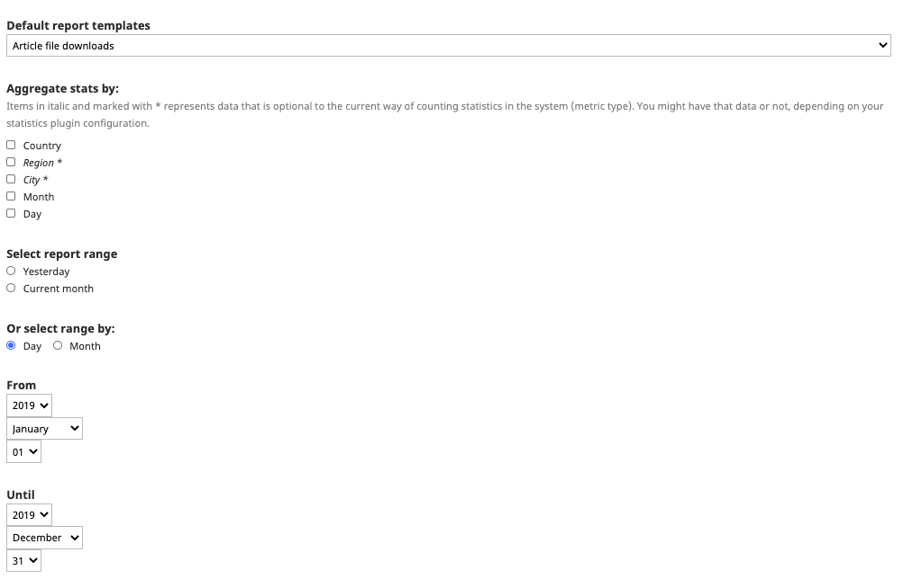

# Tilastot ja Journal.fi

## OJS-järjestelmän tilastot

OJS-järjestelmä kerää COUNTER-standardin mukaisia tilastoja, jotka koskevat artikkelin kokotekstien latausmääriä sekä artikkelin abstraktisivujen katselukertoja. 

* [Project COUNTER - Consistent, Credible, Comparable](https://www.projectcounter.org/)

### Tilastojen esittäminen julkisesti artikkeleiden yhteydessä

Artikkelin abstraktisivulla on mahdollista esittää artikkeleita koskevia latausmääriä. Mikäli haluat ne päälle, ota yhteyttä [tuki@tsv.fi](mailto:tuki@tsv.fi).

### Tilastojen lukeminen OJS:n hallintapaneelista

Toimittajat voivat tarkastella artikkeleiden latausmääriä hallintapaneelista kohdasta **Tilastot => Artikkelit / Statistics => Articles / Statistik => Artiklar** löytyvällä graafisella työkalulla. Työkaluun annetaan oikeasta yläkulmasta halutut rajaukset (aika, osastot) ja vasemmasta yläkulmasta voi valita näkyykö kuvaajassa abstrakteja vai tiedostoja koskevat luvut. Kuvaajan alle tulostuu taulukko latausmääristä.

### Tilastojen vienti ja lukeminen

Tilastoja saa ladattua omalle tietokoneelle kohdasta **Työkalut** => **Raporttigeneraattori** / **Tools** => **Report Generator / Verktyg => Rapportgenerator.** Avautuvalla sivulla on pikalinkit joihinkin valmiisiin raporttimalleihin. 

Selkeintä on kuitenkin käyttää **Luo mukautettu raportti** / **Generate Custom Report / Generera anpassad rapport** -toimintoa.

### Kuluneen vuoden artikkelilataukset

Valitse avautuvasta lomakkeesta **Artikkelitiedoston lataukset / Article File Downloads / Nedladdningar av artiklar.**

Jos et halua kuukausikohtaisia tuloksia, poista **Kokoa tilastot / Aggregate stats by / Sammanställ statistik för** -kohdasta kaikki valmiina olevat valinnat. Ilman valintoja saat valitun aikavälin mukaiset kokonaislautausmäärät artikkeleille.

Valitse aikaväli: **päivä**/**day/dag** ja vaihda **Alkaen** ja **Saakka** / **From** ja **Until** / **Från** och **Till** -valintoihin oikeat päiväykset, esimerkiksi 1.1.2019 - 31.12.2019.

Valitse **Luo mukautettu raportti** / **Generate Custom Report** / **Generera anpassad rapport.**

Järjestelmä tarjoaa hetken päästä tallennettavaksi CSV-tiedostoa. Sen lukemiseen liittyen on annettu ohjeita alempana.

Tämä raportti koskee siis artikkelin kokotekstin luku/latauskertoja. Huomaa, että osa artikkelilatauksiin kohdistuvasta liikenteestä tulee suoraan tiedostoon, eli vastaavaa osumaa ei välttämättä ole abstraktien katselukerroissa.

### Kuluneen vuoden abstraktien katselukerrat

Valitse **Artikkelin abstraktisivun katselukerrat / Article abstract page views / Visningar av abstract**.

Jos et halua kuukausikohtaisia tuloksia, poista **Kokoa tilastot**/**Aggregate stats by/Sammanställ statistik för** -kohdasta kaikki valmiina olevat valinnat. 

Valitse aikaväli: **päivä** ja vaihda **Alkaen** ja **Saakka** -valintoihin oikeat päiväykset, esimerkiksi 1.1.2016 - 31.12.2016.

Valitse **Luo mukautettu raportti**.

Järjestelmä tarjoaa hetken päästä tallennettavaksi CSV-tiedostoa. Sen lukemiseen liittyen on annettu ohjeita alla.

### Tilastojen siistintä Excelissä

OJS-vie tiedot CSV-muotoon, jonka voi avata Excel-taulukkoon. Tiedot ovat eroteltuna käytännössä pikulla. Excelin “Teksti sarakkeisiin” -toiminnolla saa taulukon selkeämpään muotoon. Valitse ensin koko ensimmäinen sarake Excelissä klikkaamalla saraketta A ja klikkaa sitten “Teksti sarakkeisiin” -toimintoa.

Valitse “Erotettu”, sitten “Seuraava”

Valitse vaihtoehto “Pilkku”, sitten “Seuraava”. Jos muita vaihtoehtoja on valittuna, valitse ne pois.

Valitse lopuksi “Valmis”. Paina OK mahdolliseen lisäkysymykseen.

Tietojen pitäisi näkyä nyt sarakkeisiin eroteltuna.

Voit lopuksi mustata sarakkeiden otsikot sisältävän rivin ja klikata “Suodata”. Saat tällä tavalla pikasuodattimet käyttöön ja voit järjestää tietoja esimerkiksi otsikon tai latausmäärän perusteella.

## Google Analytics -tilastot

Google Analytics on todennäköisesti tällä hetkellä GDPR-asetuksen vastainen, joten sen käyttöä ei suositella.
