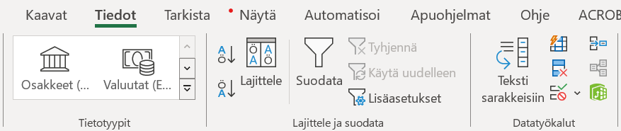

# Tilastot ja Journal.fi

## OJS-järjestelmän tilastot

OJS-järjestelmä kerää COUNTER-standardin mukaisia tilastoja, jotka koskevat artikkelin kokotekstien latausmääriä sekä artikkelin abstraktisivujen katselukertoja. 

* [Project COUNTER - Consistent, Credible, Comparable](https://www.projectcounter.org/)

### Tilastojen esittäminen julkisesti artikkeleiden yhteydessä

Artikkelin abstraktisivulla on mahdollista esittää artikkeleita koskevia latausmääriä. Mikäli haluat ne päälle, ota yhteyttä [tuki@tsv.fi](mailto:tuki@tsv.fi).

### Tilastojen lukeminen ja vienti

Toimittajat voivat tarkastella artikkeleiden latausmääriä hallintapaneelista kohdasta **Tilastot => Artikkelit / Statistics => Articles / Statistik => Artiklar** löytyvällä graafisella työkalulla. Työkaluun annetaan oikeasta yläkulmasta halutut rajaukset (aika, osastot) ja vasemmasta yläkulmasta voi valita näkyykö kuvaajassa abstrakteja vai tiedostoja koskevat luvut. Kuvaajan alle tulostuu taulukko latausmääristä.

Tilastoja saa ladattua omalle tietokoneelle tekemällä haluttu aikarajaus ja valitsemalla tämän jälkeen **Lataa raportti / Download Report / Ladda ner raport**.

Avautuvasta näkymästä voi valita joko artikkeleiden abstraktisivun katselukertoja koskevan raportin tai kokotekstin latausmääriä koskevan raportin.

### Tilastojen siistintä Excelissä

OJS-vie tiedot CSV-muotoon, jonka voi avata Excel-taulukkoon. Sarakkeisiin menevät tiedot ovat eroteltuna pikulla. Excelin “Teksti sarakkeisiin” -toiminnolla saa taulukon selkeämpään muotoon. Valitse ensin koko ensimmäinen sarake Excelissä klikkaamalla saraketta A ja klikkaa sitten “Teksti sarakkeisiin” -toimintoa.

Valitse “Erotettu”, sitten “Seuraava”

Valitse vaihtoehto “Pilkku”, sitten “Seuraava”. Jos muita vaihtoehtoja on valittuna, valitse ne pois.

Valitse lopuksi “Valmis”. Paina OK mahdolliseen lisäkysymykseen.

Tietojen pitäisi näkyä nyt sarakkeisiin eroteltuna.

Voit lopuksi mustata sarakkeiden otsikot sisältävän rivin ja klikata “Suodata”. Saat tällä tavalla pikasuodattimet käyttöön ja voit järjestää tietoja esimerkiksi otsikon tai latausmäärän perusteella.

## Google Analytics -tilastot

Google Analytics on todennäköisesti tällä hetkellä GDPR-asetuksen vastainen, joten sen käyttöä ei suositella. 
