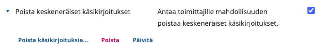
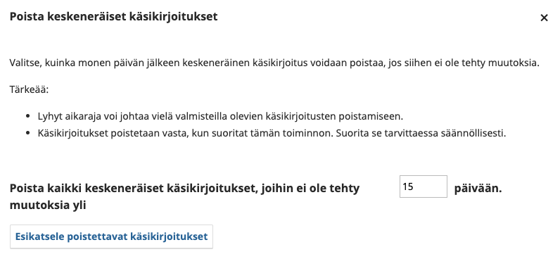
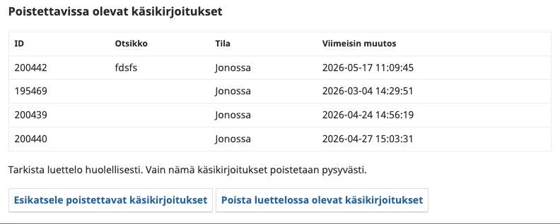

# Keskeneräisten käsikirjoitusten poisto

Järjestelmään kertyy usein käsikirjoituksia, joiden lähettäminen on jäänyt kesken jo lähetysvaiheessa. Kirjoittaja on aloittanut lähetyksen, mutta ei ole koskaan viimeistellyt sitä tai pikajulkaisulisäosalla tehty lähetys on jätetty kesken. Tällaiset keskeneräiset käsikirjoitukset eivät koskaan etene toimitusprosessiin, mutta jäävät näkyviin käsikirjoituslistaan ja voivat vaikeuttaa listan seuraamista.

**Poista keskeneräiset käsikirjoitukset / Delete Incomplete Submissions** on lisäosa, jolla toimittaja voi poistaa tällaiset keskeneräiset käsikirjoitukset kerralla.

## Lisäosan aktivointi

Siirry kohtaan **Asetukset => Verkkosivusto => Lisäosat / Inställningar => Webbplats => Plugins / Settings => Website => Plugins**.

Etsi luettelosta **Poista keskeneräiset käsikirjoitukset / Delete Incomplete Submissions** ja aktivoi se klikkaamalla lisäosan perässä oleva valintalaatikko. 

## Keskeneräisten käsikirjoitusten poistaminen

Kun lisäosa on aktivoitu, voit avata lisätoiminnot sinisellä kolmiolla. Valitse **Poista käsikirjoituksia... / Delete submissions...**.

Avautuvasta ikkunasta voit asettaa **poistokynnyksen (deletion threshold) päivinä**. Kynnys määrittää, kuinka monta päivää käsikirjoituksen tulee olla ollut passiivisena, ennen kuin se voidaan poistaa. Näin varmistetaan, ettei juuri aloitettuja, vielä kesken olevia lähetyksiä poisteta vahingossa.

Kynnyksen asettamisen jälkeen valitse esikatselun luonti. Järjestelmä listaa esikatseluun kaikki poistokriteerit täyttävät käsikirjoitukset.

Käsikirjoitus näkyy esikatselussa ja voidaan poistaa vain, jos kaikki seuraavat ehdot täyttyvät:

- käsikirjoitus on yhä tilassa **jonossa (queued)** eikä lähetystä ole koskaan viimeistelty
- käsikirjoitus on ollut passiivisena kauemmin kuin asetettu kynnysarvo
- käsikirjoitusta ei ole julkaistu eikä se odota julkaisua
- käsikirjoitukselle ei ole osoitettu DOI-tunnusta

Esikatselu vanhenee 15 minuutin kuluttua, kynnysarvon muuttamisen yhteydessä, tai kun samalle lehdelle luodaan uusi esikatselu jonkun muun käyttäjän toimesta. Jos esikatselu on ehtinyt vanhentua, se pitää luoda uudelleen ennen poistoa.

Kun olet tarkistanut esikatselun listan, voit valita **Poista luettelossa olevat käsikirjoitukset**. Jokainen käsikirjoitus tarkistetaan yllä olevien ehtojen osalta uudelleen juuri ennen poistoa, jos tilanne on ehtinyt muuttua esikatselun luonnin jälkeen.

## Huomioitavaa

**Poistaminen on lopullista, eikä poistettuja käsikirjoituksia voi palauttaa.** Tarkista esikatselun lista aina huolellisesti ennen poiston vahvistamista, erityisesti jos kynnysarvoksi on asetettu pieni arvo.

Lisäosa poistaa ainoastaan käsikirjoituksia, joiden lähettämistä ei ole koskaan viimeistelty. Se ei siis vaikuta normaalisti toimitusprosessissa oleviin, hylättyihin tai julkaistuihin käsikirjoituksiin. Jos tällaisia näkyy esikatselulistalla, ole yhteydessä tuki@tsv.fi.
