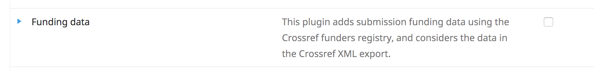
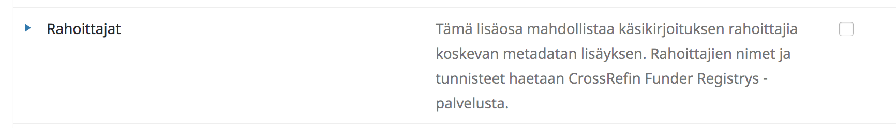
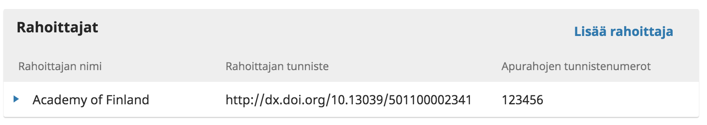
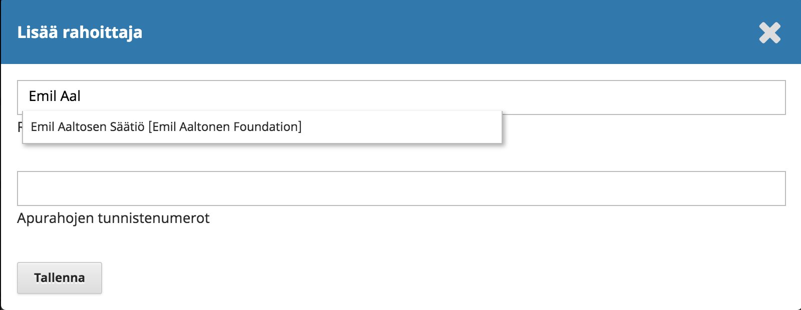

# Rahoittajatietojen keruu

Tietyllä rahoituksella tehdyn tutkimuksen löytäminen on vaikeaa, mikäli rahoituksesta kerrotaan ainoastaan artikkelin leipätekstissä. Rahoittajatiedot tulisikin tallentaa artikkelin kuvailutiedoiksi käyttäen rahoittajien pysyviä tunnisteita ja yksittäisten apurahojen tunnisteita.

Tätä varten OJS- ja OMP-järjestelmään on saatavilla lisäosa, joka avustaa rahoittajatietojen tallentamisessa ja välittämisessä eteenpäin.

## Lisäosan käyttöönotto

Lisäosan voi ottaa käyttöön kohdasta **Settings > Website > Plugins > Funding data** / **Asetukset > Verkkosivusto > Lisäosat > Rahoittajat**. Ota lisäosa käyttöön aktivoimalla sen perässä oleva valintaruutu.

## Lisäosan käyttö

Kun lisäosa on käytössä, käsikirjoitusten lähetykseen käytettävässä lomakkeessa näkyy oma kohta rahoittajatiedoille välilehdellä, jossa annetaan käsikirjoituksen kuvailutiedot. Käsikirjoituksen vastaanottamisen jälkeen sama rahoittajatietoja koskeva kohta löytyy käsikirjoituksen työnkulusta **Julkaiseminen > Rahoittajat / Publication > Funding Data**.

Esimerkkinäkymässä näkyy, että käsikirjoitukseen on liitetty Suomen Akatemian apuraha, jolla on tunniste 123456. Rahoittajan tunniste on Crossrefin antama uniikki tunniste Suomen Akatemialle.

Valitsemalla **Lisää rahoittaja** / **Add Funder** avautuu lomake, jolla voi hakea uuden rahoittajan kirjoittamalle sen nimen hakuruutuun. Lisäosa ehdottaa rahoittajia Crossrefin tietokannasta. Se millä kielellä nimi näkyy ei ole keskeistä, vaan keskeistä on valinnan mukana tallentuva rahoittajan pysyvä tunniste. 

Joidenkin rahoittajien tapauksessa lisäosa pyytää valitsemaan jonkin rahoittajan alaorganisaation, jos sellaisia on olemassa. Näin tapahtuu esimerkiksi Suomen Akatemian apurahojen tapauksessa.

Kohtaan **Apurahojen tunnistenumerot** voi antaa syöttää yksittäisten apurahojen tunnistenumeroita. Numeroita voi antaa rahoittajaa kohti useita, mutta tavallisesti artikkeli liittyy johonkin yksittäiseen apurahaan.

Paina lopuksi **Tallenna** ja apuraha on liitetty käsikirjoitukseen.

## Työnjako toimituskunnan ja kirjoittajien välillä

Rahoittajatietojen keruun yksityiskohdat ovat täysin toimituskunnan päätettävissä. Mikäli haluatte kirjoittajien liittävän rahoittajatiedot käsikirjoitukseen jo käsikirjoituksen lähetyksen yhteydessä, niin asia tulee neuvoa kirjoittajaohjeissa.

Toinen vaihtoehto on pyytää rahoittajatietoja vasta käsikirjoituksen hyväksymisen jälkeen esimerkiksi teknisen toimittamisen yhteydessä. Tällöin toimituskunta lisää ne käsikirjoituksen kuvailutietoihin kirjoittajalta saamiensa tietojen mukaisesti.
