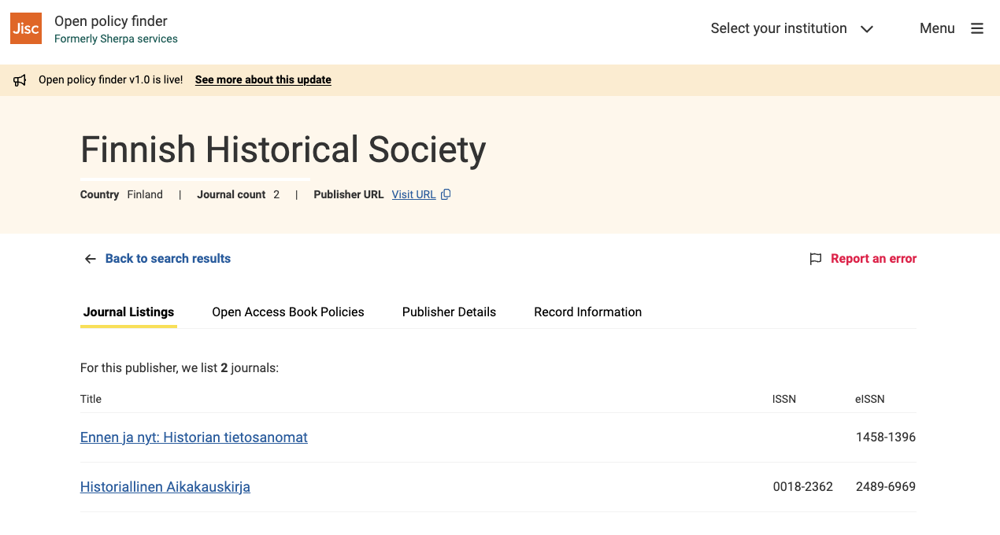

# Rinnakkaistallennus ja Open Policy Finder -palvelu

## Mikä ja miksi?

**Open Policy Finder** on palvelu, josta voi tarkistaa julkaisijan suhtautumisen rinnakkaistallentamiseen. Oman käytännön ilmoittaminen säästää siis julkaisuarkistojen työaikaa, koska julkaisijan rinnakkastallennuslinjauksen voi tarkistaa keskitetysti yhdestä paikasta. Palvelusta löytyy myös muita tietoja julkaisusarjoja koskien, kuten esimerkiksi tieto käytössä olevista lisensseistä ja mahdollisesta embargosta.

Open Policy Finder -palvelu käytti aiemmin nimeä **Sherpa Romeo**.

Rinnakkaistallentaminen tehostaa osaltaan lehden artikkeleiden ja koko lehden saamaa näkyvyyttä. Rinnakkaistallennus on myös yksi tapa täyttää [Plan S -konsortion kriteerit avoimuudelle (englanniksi)](https://coalition-s.org/about/). **Suhtautuminen rinnakkaistallennukseen kannattaa ilmoittaa Open Policy Finder -palvelussa myös siinä tapauksessa, että lehti ei salli mitään rinnakkaistallennusta**. 

Palveluun rekisteröityminen on ilmaista ja vaatii vain kertaluontoisen työpanoksen. Julkaisijan on myös mahdollista ilmoittaa kerralla kaikki lehdet, joilla sama politiikka. Mahdolliset muutokset tulee kuitenkin päivittää palveluun mahdollisimman pian.

Lisätietoja rinnakkaistallennuksesta löytyy esimerkiksi Jyväskylän yliopiston kotisivuilta:

* [https://openscience.jyu.fi/fi/rinnakkaistallentaminen/tallennusluvat](https://openscience.jyu.fi/fi/rinnakkaistallentaminen/tallennusluvat)
* [https://openscience.jyu.fi/fi/rinnakkaistallentaminen/artikkelin-eri-versiot](https://openscience.jyu.fi/fi/rinnakkaistallentaminen/artikkelin-eri-versiot)
* [https://openscience.jyu.fi/fi/rinnakkaistallentaminen/rinnakkaistallentamisen-hyodyt](https://openscience.jyu.fi/fi/rinnakkaistallentaminen/rinnakkaistallentamisen-hyodyt)

Open Policy Finder -palvelun [omat käyttöohjeet löytyvät palvelun kotisivuilta](https://openpolicyfinder.jisc.ac.uk/help).

## Lehden tietojen ilmoittaminen Open Policy Finder -tietokantaan

### Ennen kuin aloitat hakulomakkeen täyttämisen

Aluksi kannattaa tutustua [Open Policy Finder hakukriteereihin (englanniksi)](https://openpolicyfinder.jisc.ac.uk/help/records/publisher/inclusion-criteria). Julkaisijalle ja rekisteröitäville julkaisusarjoille on omat kriteerinsä.

**Kriteerit julkaisusarjoille:**

* Julkaisusarjalla on oltava voimassa oleva, kansainväliseen ISSN-portaaliin rekisteröity ISSN-tunnus. Tunnuksen tulee löytyä sarjan verkkosivuilta.
* Toimituskunnan tiedot tulee löytyä julkaisusarjan verkkosivuilta.
* Verkkosivuilta tulee myös löytyä tieto julkaisusarjan käyttämästä lisenssistä, lehden noudattamista periaatteista tekijänoikeuksien suhteen sekä periaatteista avoimen saatavuuden suhteen.
* Avoimen saatavuuden linjaukseen tulee sisältyä mahdollisuus julkaista jokin käsikirjoituksen versioista (submitted, accepted, published) avoimesti.

**Kriteerit julkaisijalle:**

* Julkaisijan yhteystietojen on löydyttävä verkkosivuilta.
* Verkkosivuilta tulee löytyä myös julkaisutoiminnan eettiset periaatteet.

Vaadittavat tiedot voivat olla julkaisusarjan verkkosivuilla millä kielellä tahansa. Lomaketta ei voi tallentaa keskeneräisenä, eli tiedot kannattaa kerätä valmiiksi.

**Aloita aina tarkistamalla** löytyykö julkaisusarjan tai julkaisijan tiedot jo tietokannasta tekemällä haku julkaisusarjan ja julkaisijan nimellä sekä ISSN-tunnuksella.[ Linkki Open Policy Finderin hakusivulle (englanniksi)](https://openpolicyfinder.jisc.ac.uk/search).

#### Julkaisusarja tai julkaisija on jo palvelussa

Jos julkaisusarjan tai julkaisijan tiedot löytyvät jo palvelusta, tietojen mahdollinen päivittäminen tehdään **Report an error** -painikkeella. Esimerkiksi [Finnish Historical Society (englanniksi)](https://openpolicyfinder.jisc.ac.uk/id/publisher/1820).

#### Julkaisija puuttuu kokonaan palvelusta

Mikäli sekä julkaisijan että lisättävän sarjan tiedot puuttuvat palvelusta, [julkaisijan tiedot tallennetaan palveluun ensimmäisen sarjan lisäämisen yhteydessä käyttämällä tätä lomaketta (englanniksi).](https://www.jisc.ac.uk/forms/submit-a-new-record-for-a-publisher-not-already-listed-in-sherpa-romeo). 

#### Julkaisija on palvelussa, mutta julkaisusarja puuttuu

Mikäli julkaisijan tiedot ovat jo palvelun tietokannassa, [voi sarjan tiedot lisätä tällä lomakkeella (englanniksi).](https://www.jisc.ac.uk/forms/submit-a-new-journal-request-for-a-publisher-already-listed-in-sherpa-romeo)

Lomake täytetään jokaiselle julkaisusarjalle erikseen. Mikäli kuitenkin useampi saman julkaisijan sarja noudattaa samoja julkaisukäytäntöjä, voi tietojen ilmoittamista nopeuttaa lomakkeessa neuvotulla tavalla (Excel-liite). Jos julkaisijan tietoja ei ole rekisteröity palveluun aiemmin, ne lisätään ensimmäisen sarjan lisäämisen yhteydessä.

### Asetukset Journal.fi- ja Edition.fi-palveluissa

Tarkista Journal.fi- tai Edition.fi-palvelussa olevasta sivustosta ainakin seuraavat asiat. Annettavien kuvausten ei tarvitse olla englanniksi, vaan ne voivat olla myös esimerkiksi suomeksi tai ruotsiksi.

#### Julkaisusarjaa koskevat tiedot

* **ISSN-tunnukset**
    * Anna ISSN-tunnukset kohtaan **Asetukset => Julkaisu => Tunnuslaatikko => Verkkojulkaisun ISSN / Painetun julkaisun ISSN**
    * Mainitse ISSN-tunnukset myös asetusten kohdassa **Asetukset => Julkaisu => Tunnuslaatikko => Tietoa julkaisusta**.
* **Toimituskunta**
    * Anna toimituskunnan tiedot koskeva kuvaus kohtaan **Asetukset => Julkaisu => Tunnuslaatikko => Toimituskunta**.
* **Lehden avoimuutta koskeva linjaus**
    * Anna kuvaus kohtaan **Asetukset => Julkaisu => Tunnuslaatikko => Tietoa julkaisusta**.
* **Rinnakkaistallennus**
    * Anna kuvaus suhtautumisesta rinnakkaistallennukseen kohtaan **Asetukset => Julkaisu => Tunnuslaatikko => Tietoa julkaisusta**
    * Muista huomioida mitä käsikirjoituksen versiota (submitted, accepted, published)  linjaukset koskevat
* **Lisenssit ja tekijänoikeus**
    * Määritä lehden lisenssejä ja tekijänoikeutta koskevat asetukset kohtaan **Asetukset => Jakelu => Lisenssi** ja **Asetukset => Jakelu => Tekijänoikeuden haltija**
    * Anna kuvaus käytössä olevista lisensseistä ja tekijänoikeudesta kohtaan **Asetukset > Työnkulku > Käsikirjoituksen vastaanotto > Kirjoittajan ohjeet > Tekijänoikeushuomautus**

#### Julkaisijaa koskevat tiedot

* **Julkaisijan nimi**
    * Anna julkaisijan nimi kohtaan **Asetukset => Julkaisu => Tunnuslaatikko => Julkaisija**
    * Mainitse julkaisijan yhteystiedot myös asetusten kohdassa **Asetukset => Julkaisu => Tunnuslaatikko => Tietoa julkaisusta**.
* **Julkaisutoiminnan eettiset periaatteet**
    * Anna eettisiä periaatteita koskeva kuvaus kohtaan **Asetukset => Julkaisu => Tunnuslaatikko => Tietoa julkaisusta**.
    * Vaihtoehtoisesti voit luoda tätä varten kokonaan oman sivun. Katso tähän liittyen ohje navigaatiovalikon muokkauksesta. Tiedot voivat olla myös julkaisijan (esimerkiksi julkaisevan seuran) kotisivuilla.

### Hakulomake

Ohjeet ovat suurilta osin samat molemmille hakulomakkeen versioille. Kohdat, joissa lomakkeet eroavat toisistaan, on merkitty ohjeeseen.

#### Your details

Lomakkeen alussa annetaan täyttäjän yhteystiedot sekä varmistetaan, että täyttäjällä on valtuudet hakemuksen jättämiseen.

#### Journal identifiers

Seuraavaksi täytetään julkaisusarjan tiedot. ISSN-tunnusten osalta riittää toinen (ISSN tai eISSN), mutta jos sarjalla on käytössään molemmat, tulee kummatkin täyttää. 

#### Publisher details

Julkaisusarjan tietojen jälkeen annetaan julkaisijan tiedot. Näitä tietoja ei tarvitse täyttää nimeä lukuunottamatta uudelleen mikäli julkaisija on rekisteröitynyt palveluun jo aiemmin. Voit tarkistaa asian [hakemalla Open Policy Finderista (englanniksi)](https://openpolicyfinder.jisc.ac.uk/search) julkaisijan nimellä. 

Jos löytyneessä julkaisijan tiedoissa on korjattavaa, voit ehdottaa muutosta erikseen julkaisijan tietueesta löytyvästä **Report an error** -napista. Katso esimerkiksi [https://openpolicyfinder.jisc.ac.uk/id/publisher/1820](https://openpolicyfinder.jisc.ac.uk/id/publisher/1820).

Jos julkaisijaa ei löydy lainkaan, annetaan sen tiedot nyt täytettävällä lomakkeella.

Governing Body URL: Osoite tulee johtaa sivulle, jossa esitellään julkaisusarjaa hallinnoiva taho. Se on taho, joka tekee julkaisusarjaan liittyviä hallinnollisia päätöksiä, eli päättää esimerkiksi siirtymisestä kokonaan avoimeen julkaisemiseen. Tiedeseurojen tapauksessa se voi olla esimerkiksi seuran hallitus.

Publication ethics URL: Osoitteen tulee johtaa sivustolle, jossa on kerrottu millaisia eettisiä periaatteita julkaisutoiminnassa noudatetaan. Nämä voivat liittyä esimerkiksi plagiointiin, vertaisarviointiin, toimituskäytäntöihin jne.

#### Open Access policy details

Mikäli olet antanut jo aiemmin jonkin toisen saman julkaisijan julkaisusarjan tiedot ja nyt lisättävällä julkaisusarjalla on samat käytännöt, voit antaa tässä linkin sellaiseen julkaisusarjaan.

Muussa tapauksessa seuraavaksi kerrotaan tarkemmin julkaisusarjan käytännöistä.

#### General Open Access policy

Tässä osiossa kuvataan tarkemmin julkaisusarjassa noudatettavia avoimen saatavuuden periaatteita: Liittyykö toteutukseen edellytyksiä (pre-requisites), eli sallitaanko avoimen saatavuuden toteuttaminen vain tietyissä tilanteissa?

* If publisher permission granted = Avoin julkaiseminen vaatii julkaisijan luvan.
* If required by funder = Tutkimuksen rahoittaja vaatii julkaisemaan avoimesti.
* If required by law = Laki edellyttää avointa julkaisemista.
* If required by institution = Suorituspaikka edellyttää avointa julkaisemista.
* If a research article = Julkaisusarja on avoin vain tutkimusartikkelien osalta.

#### Open Access policy by version

Tässä osiossa listataan avoimen saatavuuden periaatteet erikseen kullekin käsikirjoituksen eri versiolle (submitted, accepted, published). Tarkempia tietoja kysytään vain siinä tapauksessa, että version avoin saatavuus sallitaan.

Kysyttävät tarkentavat tiedot:

* Minne artikkeli voidaan tallentaa? Jos tallennuspaikkaa ei ole rajoitettu, valitaan “Any website” ja “Any repository”.
* Onko kyseessä viivästetty avoimuus, eli sallitaanko avoimuus vasta tietyn embargo-ajan jälkeen? 
* Kenellä on kyseisen käsikirjoitusversion tekijänoikeudet?
* Mikä lisenssi on käytössä?
* Muut mahdolliset ehdot (policy conditions):
    * Publisher copyright and source must be acknowledged with citation = Rinnakkaistallennetun version yhteydessä tulee mainita sitaattina tekijänoikeustiedot ja alkuperäinen julkaisupaikka.
    * Publisher copyright must be acknowledged with set statement = Rinnakkaistallennetun version yhteydessä tulee mainita tekijänoikeustiedot julkaisijan määrittämällä lausekkeella.
    * Published source must be acknowledged = Rinnakkaistallennetun version yhteydessä tulee mainita alkuperäinen julkaisupaikka.
    * Must link to publisher version = Rinnakkaistallennetun version yhteydessä tulee olla linkki julkaisijan versioon.
    * Must link to publisher version with DOI = Rinnakkaistallennetun version yhteydessä tulee olla julkaisijan versioon johtava DOI-tunnus.
    * Must link to publisher version with set statement = Rinnakkaistallennetun version yhteydessä tulee olla linkki julkaisijan versioon ja käyttää julkaisijan määrittämää lauseketta.
    * Set statement to accompany deposit = Rinnakkaistallennuksen yhteydessä tulee käyttää julkaisijan määrittämää lauseketta.
    * Written permission must be obtained from the publisher = Rinnakkaistallennukseen vaaditaan julkaisijan kirjallinen lupa.
* Vain julkaistu versio: Tallentaako julkaisija artikkelin avoimeen repositorioon?

### Useamman julkaisusarjan käytäntöjen ilmoittaminen

Jos samoja periaatteita noudatetaan useammassa saman julkaisijan julkaisusarjassa, lomaketta ei tarvitse täyttää erikseen jokaiselle sarjalle, vaan tieto sarjoista voidaan koota hakulomakkeelta ladattavaan Excel-taulukkoon. Taulukossa kysytään jokaisesta sarjasta nimi, ISSN-tunnus tai -tunnukset, linkki julkaisusarjan kotisivulle sekä linkki sivulle, jolta löytyyt tieto julkaisusarjan toimituskunnasta.
