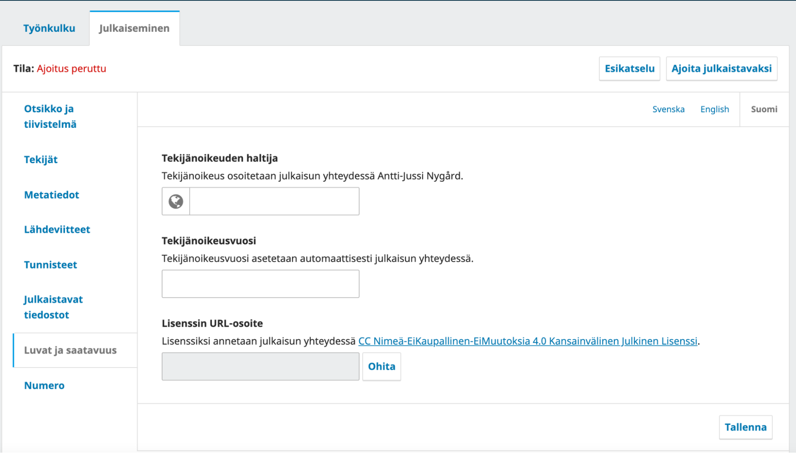
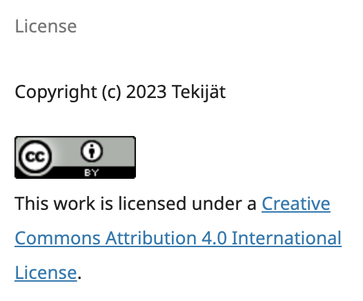

# Tekijänoikeus ja Creative Commons -lisenssit

## Tekijänoikeus

Tekijänoikeudet kuuluvat lähtökohtaisesti Suomen lainsäädännön mukaan kirjoittajalle. TSV:n suositus on, että julkaistujen sisältöjen tekijänoikeus säilyy kirjoittajalla.

Tekijänoikeudesta ja muista käsikirjoituksen julkaisua koskevista yksityiskohdista on hyvä aina tehdä kirjoittajan ja julkaisijan keskinäinen kustannussopimus. Lisätietoja sopimuksen sisältöön löydät esimerkiksi [Suomen tiedekustantajien liiton sivuilta](https://tiedekustantajat.fi/ohjeet/sopiminen/).

## Creative Commons -lisenssit

[Creative Commons –lisenssillä](https://creativecommons.fi/) kerrotaan ne ehdot, joiden mukaisesti julkaistua teosta voidaan käyttää. Eli tiedelehden tapauksessa kerrotaan lehden lukijoille, millaisilla ehdoilla julkaistuja sisältöjä, eli julkaistun sisällön kokotekstiä, voidaan käyttää. CC-lisenssi on kansainvälinen standardi, eli sen etuna on tunnettavuus ja yhteensopivuus.

Lisenssejä on erilaisia, mutta niiden lähtökohtana on aina kaksi oletusta:

**1. Lähde ja tekijä tulee aina mainita asianmukaisesti**
- Tämä koskee siis artikkelin käyttöä esimerkiksi jonkin kokonaan uuden teoksen (opetusmateriaali tms.) lähtökohtana. Aivan eri asia on viitata artikkeliin normaaliin tapaan tieteellisessä tekstissä.
**2. Alkuperäiseen teokseen tehdyt muutokset tulee tuoda esille**

Lisenssin eri muodot määrittelevät näihin lähtökohtiin joukon erilaisia poikkeuksia.

### CC-lisenssien muodot

**_CC-BY_ Nimeä 4.0 Kansainvälinen** 
Artikkelia voi vapaasti jakaa ja kopioida, sitä voi muokata ja sen pohjalta voi luoda uusia aineistoja. Edellytyksenä aiemmin mainitut vaatimukset eli tekijä ja muutokset esille.

**_CC-BY-SA_ Nimeä-JaaSamoin 4.0 Kansainvälinen** 
Sama kuin CC-BY + teos, jonka lähtökohtana tai osana tämä teos on, pitää julkaista käyttäen samaa lisenssiä (Share-alike). 

**_CC-BY-NC_ Nimeä-EiKaupallinen 4.0 Kansainvälinen**
Sama kuin CC-BY + ei saa käyttää kaupallisten teosten osana tai lähtökohtana.

**_CC-BY-ND_ Nimeä-EiMuutoksia 4.0 Kansainvälinen**
Sama kuin CC-BY + voi jakaa vain sellaisenaan, eli ei voi muokata tai ei voi käyttää uusien teosten lähtökohtana 

Lisäksi lisensseistä voi olla näiden tyyppien yhdistelmiä, eli muodot **_CC BY-NC-SA_** ja **_CC BY-NC-ND_**.

Lisätietoja lisensseista löytyy CC-lisenssien esittelysivuilta: [About CC Licenses](https://creativecommons.org/share-your-work/cclicenses/).

Tiedekustantamisen näkökulmasta lisenssejä on tarkasteltu raportissa _[Ohje tekijänoikeuksiin liittyvästä avoimesta lisensoinnista tutkijoille ja tieteellisille kustantajille](https://doi.org/10.23847/isbn.9789525995350)_.

### Lisenssien käyttö

Tieteellisten seurain valtuuskunta suosittelee, että julkaisijat käyttävät Creative Commons -lisenssejä julkaistavissa sisällöissään. Valtion julkaisuavustuksen kriteereiden mukaisia lisenssejä ovat CC BY, CC BY-SA tai CC BY-ND (2024).

Journal.fi-palvelussa ja Edition.fi-palvelussa julkaistavien artikkeleiden ja kirjojen _metadatan_ lisenssi pitää olla **CC0**, jolla sallitaan kuvailutietojen vapaa käyttö erilaisissa tietokannoissa. Metadatan lisenssi on määritetty palveluita koskevassa sopimuksessa. Tämä ei koske artikkelin kokotekstiä. Lisätietoja CC0-lisenssistä: [CC0](https://creativecommons.org/share-your-work/public-domain/cc0/).

## Lisenssejä ja tekijänoikeutta koskevat asetukset Journal.fi- ja Edition.fi-palvelussa

### Julkaistavien sisältöjen lisenssien ja tekijänoikeuden määrittäminen

#### Lisenssejä ja tekijänoikeutta koskevat asetukset

Lisenssejä koskevat asetukset annetaan kohdasta **Asetukset** => **Jakelu** => **Lisenssi** / **Settings** => **Distribution** => **License / Inställningar => Distribution => Licens**.

Tekijänoikeuden haltijaa koskeva asetus annetaan samalla sivulla kohdassa **Asetukset** => **Jakelu** => **Tekijänoikeuden haltija** / **Settings** => **Distribution** => **Copyright Holder / Inställningar => Distribution => Upphovsrättsinnehavare**.

Asetuksista ei voi suoraan muuttaa jo julkaistujen artikkeleiden/kirjojen lisenssiä tai tekijänoikeusmerkintää. Asetuksiin tallennetaan ne oletukset, joita artikkelin/kirjan julkaisun yhteydessä tarjotaan liitettäväksi julkaistavaan sisältöön.

Asetusten muokkaamisen jälkeen paina “Tallenna”. Seuraavaan julkaistavaan sisältöön tulee nyt uusien asetusten mukaiset tekijänoikeuden ja lisenssin tiedot.

Asetuksen muuttaminen ei vaikuta suoraan artikkeleihin/kirjoihin liitettyihin, vanhoihin artikkeleihin liitetty lisenssi ja tiedot säilyy.

#### Lisenssin ja tekijänoikeustiedon vaihtaminen artikkeli/kirjakohtaisesti

Lisenssi liitetään artikkeliin/kirjaan tuotantovaiheessa **Julkaiseminen / Publication / Publicering** -välilehdeltä, josta muokataan myös muita kuvailutietoja.

Kuvailutietolomakkeessa on kohta **Luvat ja saatavuus** / **Permissions & Disclosure / Behörigheter & tillgänglighet**. Mikäli asetuksista on annettu oletuslisenssi, näkyy lomakkeessa esikatseluna mikä lisenssi liitetään julkaisun yhteydessä. Mikäli julkaistavaa artikkelia/kirjaa koskee jokin muu lisenssi, voi valita kohdan **Ohita** ja lisätä jonkin toisen lisenssin osoitteen ja painaa lopuksi **Tallenna**.

#### Lisenssin esittäminen kokotekstitiedostossa

Lisenssi suositellaan liitettäväksi näkyviin myös artikkelin kokotekstiin. Tämä tapahtuu taittovaiheessa. Kokotekstissä kannattaa käyttää käytössä olevan lisenssin kuvaketta.

Painokelpoiset kuvakkeet löytyy osoitteesta:  [https://creativecommons.org/about/downloads/](https://creativecommons.org/about/downloads/)

### Tekijänoikeutta koskevien kuvausten määrittäminen

Tekijänoikeuksia koskevat kuvaukset on hyvä lisätä kahteen asetukseen.

#### Tekijänoikeushuomautus

Käsikirjoitusta lähetettäessä käyttäjälle voidaan näyttää tekijänoikeuksista kertova teksti, joka hänen pitää hyväksyä. Tähän tekstissä on hyvä kertoa ainakin kenelle tekijänoikeus julkaistuissa artikkeleissa kuuluu, mitä lisenssiä käytetään ja millaisia kirjoittajasopimuksia on käytössä. Kirjoittajasopimuksen tekstin voi myös linkittää tekstiin.

Asetus löytyy kohdasta **Asetukset > Työnkulku > Käsikirjoituksen vastaanotto > Kirjoittajan ohjeet > Tekijänoikeushuomautus / Settings > Workflow > Submission > Author Guidelines > Copyright Notice / Inställningar > Arbetsflöde > Bidrag > Riktlinjer för författare > Upphovsrättsdeklaration**

**Tekijänoikeushuomatuksen esimerkkirakenne:**

* Todetaan, että kirjoittajien kanssa tehdään kustannussopimus ja tarvittaessa linkitetään sopimusteksti.
* Kuvataan kenelle julkaistavien sisältöjen tekijänoikeus kuuluu
* Kuvataan millaista lisenssiä käytetään ja linkitetään lisenssin ehdot
* Kerrotaan, että julkaistavien sisältöjen metadatan lisenssi on CC0
* Kuvataan julkaisijan suhtautuminen rinnakkaistallennukseen

#### Lisenssin ehdot

Artikkelin laskeutumissivulle näkyy lisenssin ja tekijänoikeuden asetusten mukaiset tiedot, jotka on liitetty kyseiseen artikkeliin.

Näiden tietojen lisäksi lisenssiä koskien voi antaa myös jokaisen artikkelin laskeutumissivulla näkyviä vapaamuotoisia lisätietoja asetusten kohdasta **Asetukset > Jakelu > Lisenssi > Lisenssin ehdot Settings => Distribution => License => License Terms / Inställningar => Distribution => Licens => Licensvillkor.**

Tässä asetuksessa ei kannata kerrata sellaisia tietoja, jotka näkyvät jo tekijänoikeutta ja lisenssiä koskevissa asetuksissa, kuten CC-lisenssin tarkemmat ehdot tai tekijänoikeuden haltija. Mahdollisia annettavia lisätietoja voi olla esimerkiksi artikkelin metadatan lisenssiä tai rinnakkaistallennuslupaa koskevat tiedot. Tähän annettavan kuvauksen on hyvä olla lyhyt.
