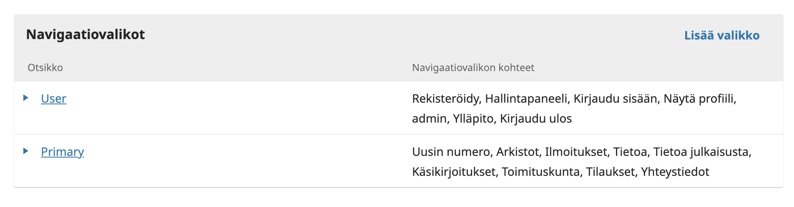
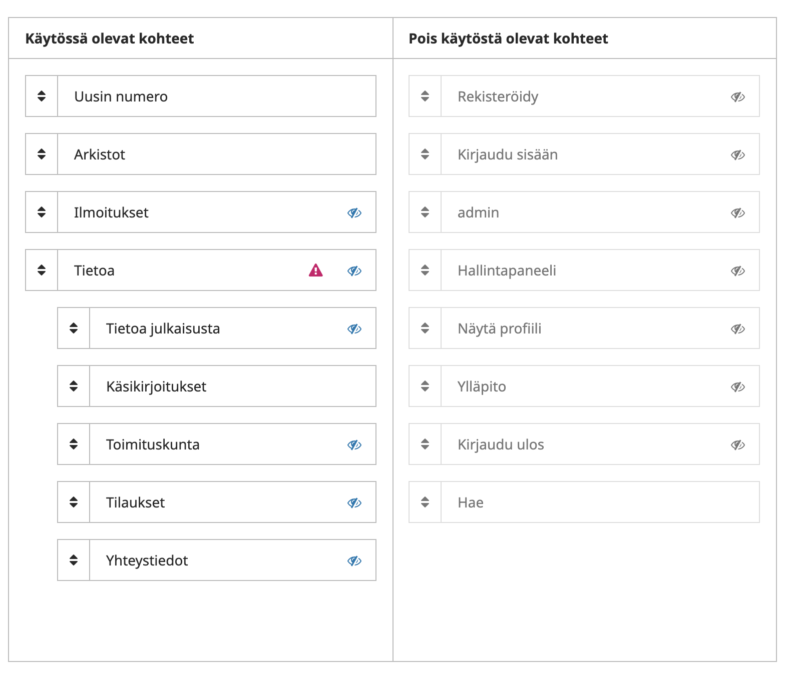
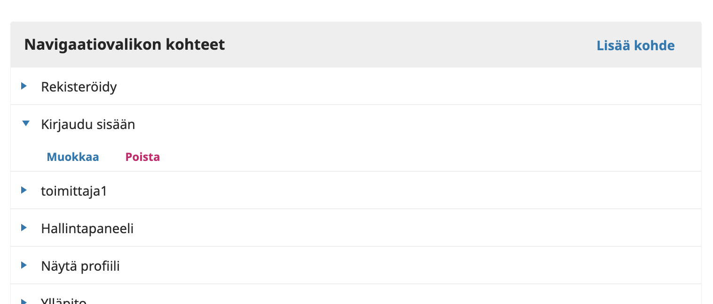
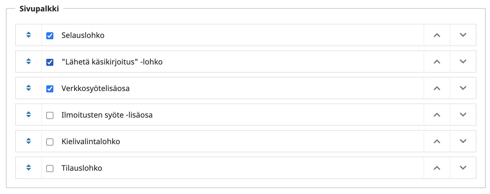
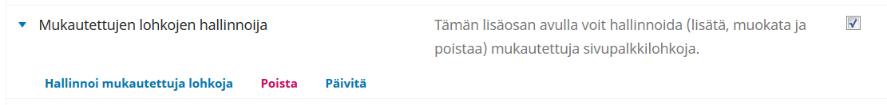

# Oman sivuston ulkoasun ja navigaatiovalikon muokkaus Journal.fi- ja Edition.fi-palveluissa

## Mitä ulkoasuteemat ovat

Open Journal Systems ja Open Monograph Press -järjestelmissä on mahdollista muokata lukijoille näkyvää sivuston ulkoasua ulkoasuteemojen avulla. Teemalla voidaan määrittää esimerkiksi oman sivuston värejä sekä yksittäisten sivujen taittopohjia. Oletuksena OJS ja OMP järjestelmissä on järjestelmän kehittäjän ylläpitämä _Default_-teema.

## Tarjolla olevat teemat

Julkaisija voi valita vapaasti oman ulkoasuteeman. Ylläpidon helpottamiseksi suosittelemme kuitenkin TSV:n ylläpitämän perusteeman käyttöä.

Palvelujen käyttöehtojen mukaisesti TSV vastaa TSV:n valmistaman perusteeman sekä OJS/OMP-järjestelmän mukana tulevan perusteeman versiopäivityksistä. Tämä tarkoittaa siis tilanteita, jossa OJS/OMP-järjestelmään tulevat versiopäivitykset vaikuttavat jollakin tavalla ulkoasuteemojen toimintaan.

Julkaisija voi myös teettää kokonaan oman ulkoasuteeman. Tällöin versiopäivitysten yhteydessä ilmenevät muutostarpeet jäävät lehden vastuulle.

## TSV:n perusteeman muokkaus

Julkaisija voi pyytää oman version TSV:n perusteemasta lähettämällä sähköpostia osoitteeseen [tuki@tsv.fi](mailto:tuki@tsv.fi). 

Mikäli julkaisija haluaa perusteeman käyttöön, sille tehdään oma ns. lapsiteema. Lapsiteema perii suurimman osan ulkoasuun liittyvistä seikoista ns. emoteemalta, eli TSV:n perusteemalta. Kaikki julkaisijaa koskevat muutokset tehdään lapsiteemaan, eli sinne lisätään tavallaan vain julkaisijaa koskevat poikkeukset. Tällä tavalla perusteemaa käyttävien julkaisijoiden ulkoasut saadaan pysymään hyvin ajantasalla, koska suurin osa teknisistä muutoksista  tehdään samaan perusteemaan, josta muutokset vaikuttavat kaikkiin lapsiteemoihin. 

**Teeman valmistamista varten julkaisijan tulee toimittaa TSV:lle:**

* Yläpalkin kuva. Koko 2300x340 pikseliä. Kuvasta näkyy tavallisesti vain 1200-1600 pikseliä keskeltä. Kuvan sijaan voidaan käyttää myös toistuvaa taustakuviota tai pelkkää kiinteää väriä. Kuva voi olla png- tai jpg-muodossa. Väri ilmoitetaan heksadesimaalimuodossa, esim. _#2596be_
* Logo. Lehden tai julkaisijan logo kannattaa tallentaa **png**-muotoon ja **läpinäkyvällä** taustalla. Logon korkeuden tai leveyden tulee olla vähintään 200 pikseliä.
* Värit. Periaatteessa kaikkia teeman värejä voidaan muuttaa. Värit ilmoitetaan heksadesimaalimuodossa, esim. _#2596be_

Tämän lisäksi kaikki tekstisisällöt ovat muokattavissa hallintapaneelin kautta.

TSV:n perusteema on esimerkiksi seuraavien lehtien käytössä Journal.fi-palvelussa:

* [Virittäjä](https://journal.fi/virittaja)
* [Gerontologia](https://journal.fi/gerontologia)
* [Fennia - International Journal of Geography](https://fennia.journal.fi/)

## Sivuston navigaatiovalikon muokkaus

Sivustolla näkyvän navigaatiovalikon muokkaus vaatii käyttäjältä toimittajan tai lehden/julkaisijan sivuston hallinnoijan oikeudet. 

Toiminto löytyy kohdasta **Asetukset** > **Verkkosivusto** > **Asetukset** > **Navigaatiovalikot** / **Settings** > **Website** > **Setup** > **Navigation**.

Avautuvan näkymän yläosassa on listattuna luodut valikot. Oletuksena valikkoja ovat **User** ja **Primary**.

**User**-valikko on sivun oikeasta yläreunasta avautuva vetovalikko. Lähtökohtaisesti sen sisältöön ei kannata koskea.

**Primary**-valikko on sivuston julkinen navigaatiovalikko.

### Navigaatiovalikon järjestäminen

Klikkaa navigaatiovalikon nimeä (User tai Primary). Avautuvassa näkymässä on listattuna vasemmalle puolelle valikossa käytössä olevat kohteet. Osittain sisennetyt kohteet ovat tietyn valikon kohteen alakohteita. Esimerkiksi alla kohta **Käsikirjoitukset** on järjestetty kohteen **Tietoa** alle. Silmää esittävä kuvake tarkoittaa sitä, että kyseisen valikon kohteen näkyvyys riippuu asetuksista. Esimerkiksi **Ilmoitukset**-kohde näkyy vain mikäli ilmoitukset-toiminto on sivustolla käytössä.

Voit järjestää valikon kohteita yksinkertaisesti klikkaamalla ja raahaamalla niitä uusille paikoille pitäen samalla hiiren painiketta alhaalla.

Oikealla puolella näkymässä on tarjolla olevat kohteet, joita voi lisätä valikkoon raahaamalla. Vastaavasti kohteita voi poistaa valikosta raahaamalla ne oikealle puolelle.

Muista aina painaa lopuksi **Tallenna** lomakkeen alaosasta.

### Kohteen lisääminen navigaatiovalikkoon

Kaikki valikkoon valittavissa olevat kohteet on listattuna kohtaan **Navigaatiovalikon kohteet/Navigation Menu Items**. Klikkaamalla yksittäisen kohteen edessä olevaa sinistä kolmiota ja valitsemalla **Muokkaa/Edit **pääset muuttamaan sen tietoja.

Uuden kohteen voi lisätä valitsemalla** Lisää kohde/Add item**.

Avautuvasta lomakkeessa annetaan ensin kohteelle nimi, jolla se näkyy navigaatiotivalikkoa muokattaessa. Kohteen tyyppi valitaan vetovalikosta.

Käytetyimmät tyypit ovat **URL**-osoite ja **Muokattu sivu/Custom page**.

Jos haluat valikkoon linkin, joka johtaa esimerkiksi seuran sivuille, valitse vaihtoehto **URL** ja 

anna valinnan jälkeen avautuvaan kohtaan halutun sivun URL-osoite.

Jos haluat luoda vapaamuotoisen julkisen sivun, johon voit lisätä tekstiä ja kuvia, valitse **Muokattu sivu/Custom page**. Avautuvaan lomakkeeseen annetaan sivun polku (tämä ei saa sisältää ääkkösiä eikä välilyöntejä, korjaa ne tavuviivalla) sekä itse sivun sisältö.

Kun uusi kohde on lisätty, voit muokata haluttua navigaativalikkoa  ja raahata uusi kohde valikkoon. Muista painaa lopuksi **Tallenna**.

### Kohteen muokkaus

Valitse jonkin kohteen edessä oleva sininen kolmio ja valitse “Muokkaa”. Tehdyt muutokset vaikuttavat automaattisesti jo navigaatiovalikkoon lisättyyn kohteeseen.

## Sivuston sivupalkin muokkaus

TSV:n perusteemassa ja järjestelmän Default-perusteemassa on oikealle puolelle sijoittuva sivupalkki, johon voi lisätä hallintapaneelin kautta sisältöjä. Järjestelmässä on niin sanottuja “lohkolisäosia”, jotka luovat sivupalkkia varten jonkinlaisen sisällön.

Sivupalkissa näkyvät “lohkot” valitaan kohdasta **Asetukset** => **Verkkosivusto** => **Ulkoasu** => **Asetukset** / **Settings** => **Website** => **Appearance** => **Setup**

Lohkot saa näkyviin sivupalkkiin aktivoimalla ne valintalaatikosta. Lohkojen järjestystä voi muuttaa sivussa näkyvistä nuolista. Muista aina painaa lopuksi **Tallenna**.

Itse tehtyjä lohkoja voi lisätä kohdasta **Asetukset** => **Verkkosivusto** => **Lisäosat** => **Mukautettujen lohkojen hallinnoija** / **Settings** => **Website** => **Plugins** => **Custom Block Manager**

Kytke lisäosa päälle ja valitse “Hallinnoi mukautettuja lohkoja”. Avautuvassa ikkunassa näkyvät kaikki lehden luodut mukautetut lohkot. Voit lisätä uuden valitsemalla “Lisää lohko”. Lohkoon voi lisätä tekstiä ja/tai kuvia, kuten logoja. Kun olet luonut uuden lohkon, saat sen näkyviin yllä kuvatusta sivupalkin hallinnoinnista.
