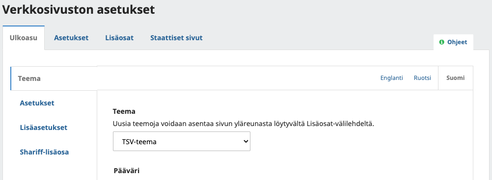

# Ulkoasun muokkaus Journal.fi- ja Edition.fi-palveluissa

## Mitä ulkoasuteemat ovat

Open Journal Systems ja Open Monograph Press -järjestelmissä on mahdollista muokata lukijoille näkyvää sivuston ulkoasua ulkoasuteemojen avulla. Teemalla voidaan määrittää esimerkiksi oman sivuston värejä sekä yksittäisten sivujen taittopohjia. Oletuksena OJS ja OMP järjestelmissä on järjestelmän kehittäjän ylläpitämä _Default_-teema.

## Tarjolla olevat teemat

Julkaisija voi valita vapaasti oman ulkoasuteeman. Ylläpidon helpottamiseksi suosittelemme kuitenkin TSV:n ylläpitämän perusteeman käyttöä.

Palvelujen käyttöehtojen mukaisesti TSV vastaa TSV:n valmistaman perusteeman sekä OJS/OMP-järjestelmän mukana tulevan perusteeman versiopäivityksistä. Tämä tarkoittaa siis tilanteita, jossa OJS/OMP-järjestelmään tulevat versiopäivitykset vaikuttavat jollakin tavalla ulkoasuteemojen toimintaan.

TSV:n perusteemaan voi tutustua tarkemmin OJS-testisivustolla [https://ojstest.tsv.fi](https://ojstest.tsv.fi) tai OMP-testisivustolla [https://omptest.tsv.fi](https://omptest.tsv.fi).

Julkaisija voi myös teettää kokonaan oman ulkoasuteeman. Tällöin versiopäivitysten yhteydessä ilmenevät muutostarpeet jäävät lehden vastuulle.

## TSV:n perusteeman käyttöönotto

### Teeman aktivointi
Siirry kohtaan **Asetukset > Verkkosivusto > Lisäosat / Settings > Website > Plugins** ja aktivoi **TSV-teema / TSV Theme** -niminen lisäosa. 

Kohdasta **Asetukset > Ulkoasu > Teema / Settings > Appearance > Theme** valitkaa teemaksi aktivoitu TSV-teema ja tallentakaa asetukset

### Teeman muokkaus

Kysymykset perusteeman käyttöönotosta [tuki@tsv.fi](mailto:tuki@tsv.fi). 

#### Teeman asetukset
Kohdassa **Asetukset > Ulkoasu > Teema / Settings > Appearance > Theme** voi muuttaa teeman asetuksia.

**Pääväri** koskee väriä, jota käytetään mm. linkkeihin sekä vaaleampien teemassa näkyvien sävyjen muodostamiseen. **Huom!** Muistakaa väriä valittaesa saavutettavuus, eli riittävän tumma väri vaaleaa taustaa vasten.

**Tunnuslause** on teksti, joka näkyy sivuston yläpalkissa lehden/julkaisijan nimen tai lisätyn logon alla.

**Ylätunnistekuvion toisto** Mikäli yläpalkin taustakuvaksi lisätään toistuva kuvio, voi tämän valinnan avulla asettaa kuva toistumaan. Mikäli yläpalkin taustakuva on suurempi kuva, niin tämä valinta pidetään valinnassa Ei.

**Sivupalkin sijainti** Artikkeleiden ja kirjojen laskeutumissivuilla näkyy lisätietoja sisältävä sivupalkki. Sen voi asettaa näkymään joko abstraktin jälkeen (sivun alaosa) tai vaihtoehtoisesti abstraktin rinnalle (sivun reuna).

#### Sivustolla näkyvä logo

Oman sivuston yläpalkkiin saa lehden/julkaisijan nimen tilalle näkyviin logon.

Logo lisätään kohdasta **Asetukset > Ulkoasu > Asetukset / Settings > Appearance > Setup**. 

Lehden tai julkaisijan logo kannattaa tallentaa **png**-muotoon ja **läpinäkyvällä** taustalla. Logon korkeuden tai leveyden tulee olla vähintään 200 pikseliä. Muista kiinnittää huomiota siihen, että logo erottuu selkeästi valittua taustakuvaa tai -väriä vasten.

Logon lisäämisen jälkeen muista tallentaa asetussivu.

#### Yläpalkin taustakuvan vaihto

Kohdasta **Asetukset > Ulkoasu > Asetukset / Settings > Appearance > Setup** voi lisätä yläpalkkiin halutun taustakuvan kohtaan **Etusivun kuva / Homepage Image**. 

Kuvalla ei ole tarkkaa kokovaatimusta, mutta hyvä leveys on esimerkiksi 2500 pikseliä. Yli 3000 pikseliä leveitä kuvia ei kannata käyttää. Jos kuva on yläpalkkia isompi, niin teema näyttää siitä osan riippuen selaimen ikkunan koosta. **Huom!** Myös taustakuvassa on hyvä muistaa saavutettavuus ja riittävä kontrasti yläpalkin logon tai tekstien sekä taustan välillä eri kokoisilla ikkunoilla. Lisäksi on hyvä kiinnittää huomiota kuvan kokoon. Hyvä tavoitekoko yläpalkin kuvalle on 400-600 kilotavua.

Kuvan lisäämisen jälkeen muista tallentaa asetussivu.

#### Navigointipalkin muokkaus

[Sivustolla näkyvää navigointipalkkia voi muokata erillisen ohjeen avulla](yleiset/navigointi.md).

