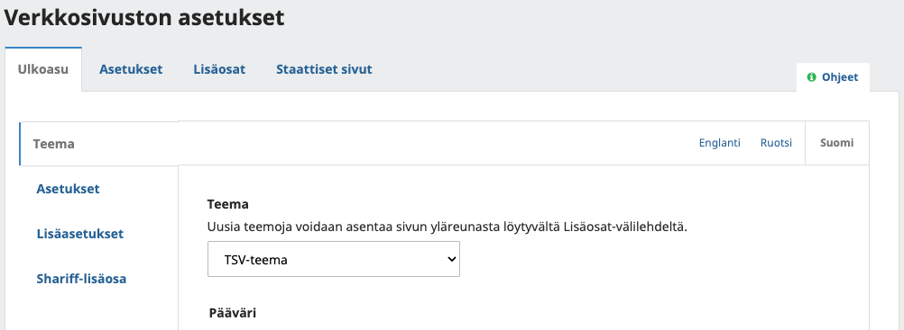

# Ulkoasun muokkaus Journal.fi- ja Edition.fi-palveluissa

## Mitä ulkoasuteemat ovat

Open Journal Systems ja Open Monograph Press -järjestelmissä on mahdollista muokata lukijoille näkyvää sivuston ulkoasua ulkoasuteemojen avulla. Teemalla voidaan määrittää esimerkiksi oman sivuston värejä sekä yksittäisten sivujen taittopohjia. Oletuksena OJS ja OMP järjestelmissä on järjestelmän kehittäjän ylläpitämä _Default_-teema.

## Tarjolla olevat teemat

Julkaisija voi valita vapaasti oman ulkoasuteeman. Ylläpidon helpottamiseksi suosittelemme kuitenkin TSV:n ylläpitämän perusteeman käyttöä.

Palvelujen käyttöehtojen mukaisesti TSV vastaa TSV:n valmistaman perusteeman sekä OJS/OMP-järjestelmän mukana tulevan perusteeman versiopäivityksistä. Tämä tarkoittaa siis tilanteita, jossa OJS/OMP-järjestelmään tulevat versiopäivitykset vaikuttavat jollakin tavalla ulkoasuteemojen toimintaan.

TSV:n perusteemaan voi tutustua tarkemmin OJS-testisivustolla [https://ojstest.tsv.fi](https://ojstest.tsv.fi) tai OMP-testisivustolla [https://omptest.tsv.fi](https://omptest.tsv.fi).

Julkaisija voi myös teettää kokonaan oman ulkoasuteeman. Tällöin versiopäivitysten yhteydessä ilmenevät muutostarpeet jäävät lehden vastuulle.

## TSV:n perusteeman käyttöönotto

Siirry kohtaan **Asetukset > Verkkosivusto > Lisäosat / Settings > Website > Plugins** ja aktivoi **TSV-teema / TSV Theme** -niminen lisäosa. 

Kohdasta **Asetukset > Ulkoasu > Teema / Settings > Appearance > Theme** valitkaa teemaksi aktivoitu TSV-teema ja tallentakaa asetukset

## TSV-teeman asetukset

Sivuston ulkoasuun vaikuttavat sekä teeman omat asetukset että useat OJS:n ja OMP:n perusasetukset. Tässä ohjeessa käydään läpi molemmat: ensin OJS:lle ja OMP:lle yhteiset asetukset, sitten kummankin järjestelmän omat asetukset.

### Yhteiset asetukset (OJS ja OMP)

#### Teeman omat asetukset

Nämä löytyvät kohdasta **Ulkoasu > Teema**.

**Pääväri**
Määrittää linkkien, painikkeiden ja ylätunnisteen taustan värin. Jos väri on tumma, ylätunnisteen teksti näytetään valkoisena, ja jos väri on vaalea, tummana. Tarkista, että logo erottuu pääväristä hyvin (ks. Logo alla).

**Tunnuslause**
Valinnainen, yhden rivin lause, joka näkyy logon alla ylätunnisteessa. Näkyy vain, jos yläpalkin kuva on asetettu.

**Nimi logon alla**
Näyttää lehden tai julkaisijan nimen logon alla ylätunnisteessa. Kannattaa ottaa käyttöön, jos logokuva ei jo sisällä nimeä. Toimii vain, jos sekä logo että yläpalkin kuva on asetettu.

**Ylätunnistekuvion toisto**
Jos yläpalkin kuva on toistuva kuvio, tämä saa kuvan toistumaan ja täyttämään tilan suurilla näytöillä.

**Ylätunnisteen kuvan korkeus**
Valitse, onko yläpalkin kuva etusivulla korkeampi kuin muilla sivuilla, vai sama korkeus kaikkialla.

**Logo mobiiliylätunnisteessa**
Valitse, mitä mobiililaitteilla näkyvän sivuston yläpalkissa näytetään: pelkkä julkaisijan/lehden nimi, lehden/julkaisijan logo vai pikkuva. Jos valittua kuvaa ei ole asetettu, näytetään nimi.

**Etusivun osiot**
Valitse, mitkä osiot näkyvät etusivulla ja missä järjestyksessä. Osion voi poistaa etusivulta kokonaan jättämällä sen valitsematta. Järjestystä voi muuttaa raahaamalla. Käytettävissä olevat osiot eroavat OJS:ssä ja OMP:ssä, ja ne on lueteltu tämän ohjeen OJS- ja OMP-osioissa.

OJS/OMP-järjestelmille yhteiset osiot ovat:

-  **Etusivun sisältö** – ks. *Etusivun lisäsisältö* alla
-  **Ilmoitukset** – ks. *Ilmoitukset* alla
-  **Lohkot** – ks. *Etusivun lohkot* alla

**Etusivun lohkot**
Valitse, mitkä lohkot näkyvät etusivun Lohkot-osiossa ja missä järjestyksessä. Tämä on **eri asetus** kuin Sivupalkki-asetus (ks. alla), joka koskee alatunnistetta ja tiettyjä sisäsivuja. Lohkot-osio pitää lisäksi valita näkyviin Etusivun osiot -asetuksesta, jotta se näkyy etusivulla.

#### Logo

**Ulkoasu > Asetukset > Logo**

Logo näkyy sivuston ylätunnisteessa kaikilla sivuilla. Jos logoa ei ole asetettu, sen paikalla näytetään lehden tai julkaisijan nimi tekstinä.

Logon tausta riippuu siitä, onko etusivun kuva asetettu:

-  **Ilman yläpalkin taustakuvaa** logo näkyy pääväriä vasten matalassa ylätunnisteessa.

-  **Yläpalkin taustakuvan kanssa** logo näkyy kuvan päällä keskitettynä, ja sen alle voi lisätä nimen ja tunnuslauseen.

Logo näkyy lisäksi:
- mobiililaitteiden yläpalkissa, jos teeman asetus *Logo mobiiliylätunnisteessa* on "Logo"
- mobiililaitteilla etusivun kuvan päällä (vain etusivulla)
- valkoista taustaa vasten artikkeli- tai kirjasivun "Julkaistu"-lohkossa (ks. OJS- ja OMP-osiot)

**Suositukset:**

- Käytä PNG-kuvaa läpinäkyvällä taustalla.
- Logon korkeus näytöllä on noin 100–190 pikseliä, joten lataa kuva, jonka korkeus on vähintään noin 400 pikseliä, jotta se näkyy terävänä myös tarkoilla näytöillä.
- Rajaa kuva tiukasti logon ympäriltä. Ylimääräinen tyhjä tila pienentää logoa.
- Jos logossa ei ole lehden tai julkaisijan nimeä, ota käyttöön teeman asetus *Nimi logon alla*.

#### Yläpalkin kuva

**Ulkoasu > Asetukset > Etusivun kuva**

Teema käyttää asetuksissa olevaa Etusivun kuvaa yläpalkin taustakuvana.

-  **Tietokoneella** kuva näkyy ylätunnisteessa kaikilla sivuilla. Etusivulla se on oletuksena korkeampi ja muilla sivuilla matalampi. Korkeutta voi säätää teeman asetuksella *Ylätunnisteen kuvan korkeus*.
-  **Mobiililaitteilla** kuva näkyy vain etusivulla, yläpalkin alapuolella.

*Tunnuslause* ja *Nimi logon alla* toimivat vain, kun etusivun kuva on asetettu.

**Suositukset:**
- Käytä leveää kuvaa, esimerkiksi 1920 × 640 pikseliä (kuvasuhde 3:1)
- Kuva rajautuu eri näytöillä ja sivuilla eri tavoin, joten pidä tärkein sisältö keskellä. Reunoille ei kannata sijoittaa tekstiä tai tärkeitä yksityiskohtia.
- Logo ja teksti näytetään kuvan päällä, joten melko rauhallinen ja tasasävyinen kuva toimii parhaiten. Tarkista, että logo ja tunnuslause erottuvat kuvasta.

- Toistuva kuvio: lataa kuvion yksi ruutu ja ota käyttöön teeman asetus *Ylätunnistekuvion toisto*.

#### Pikkukuva (thumbnail)

**Ulkoasu > Asetukset > Julkaisun pikkukuva (OJS) / Julkaisijan pikkukuva (OMP)**

Pikkukuva näkyy mobiililaitteiden yläpalkissa, jos teeman asetus *Logo mobiiliylätunnisteessa* on "Pikkukuva". Yläpalkki on matala, joten pieni ja selkeä kuva, esimerkiksi logon tunnusosa ilman tekstiä, toimii parhaiten. OMP:ssä pikkukuvalla on lisäksi toinen käyttötarkoitus (ks. OMP-osio).

#### Lehden tai julkaisijan kuvaus

**Asetukset > Julkaisu > Tunnuslaatikko > *Julkaisu lyhyesti* (OJS) / Asetukset > Julkaisija > Tunnuslaatikko > *Julkaisijan yhteenveto* (OMP)**

Tämä lyhyt kuvaus näkyy teemassa useassa paikassa:

-  **alatunnisteessa kaikilla sivuilla** lehden tai julkaisijan nimen alla
- artikkeli- tai kirjasivun "Julkaistu"-lohkossa
-  **etusivulla**, jos etusivun lisäsisältöä (ks. alla) ei ole täytetty

**Suositukset:**
- Kirjoita 1–3 virkettä, esimerkiksi mitä lehti tai julkaisija julkaisee ja kuka sitä julkaisee.
- Käytä pelkkää tekstiä: ei otsikoita, kuvia, taulukoita tai pitkiä linkkilistoja. Kuvaus näkyy kapeassa tilassa alatunnisteessa.
- Pidempi esittely kuuluu *Tietoa lehdestä / julkaisijasta* -sivulle ja etusivun lisäsisältöön.

#### Etusivun lisäsisältö

**Ulkoasu > Lisäasetukset > Lisäsisältö**

Lisäsisältö näkyy etusivun **Etusivun sisältö** -osiossa. Osio pitää valita näkyviin teeman asetuksesta *Etusivun osiot*. Sen paikka etusivulla määräytyy samasta asetuksesta. Oletuksena se on ensimmäisenä.

Jos lisäsisältö on tyhjä, osiossa näytetään sen sijaan lehden tai julkaisijan lyhyt kuvaus. Tällöin sama teksti näkyy etusivulla kahdesti (sisältöosiossa ja alatunnisteessa), joten lisäsisältö kannattaa täyttää.

#### Navigointipalkin muokkaus

[Sivustolla näkyvää navigointipalkkia voi muokata erillisen ohjeen avulla](navigointi.md).

#### Sivupalkki ja lohkot

**Ulkoasu > Asetukset > Sivupalkki**

Nimestään huolimatta TSV-teemassa ei ole perinteistä sivupalkkia joka sivulla. Sivupalkkiin valitut lohkot näytetään:

-  **alatunnisteessa** omana palstanaan kaikilla sivuilla, paitsi niillä, joilla lohkot näkyvät sisällön vieressä
-  **sisällön vieressä** OJS:n artikkelisivulla (jos teeman asetus niin määrää) ja OMP:n luettelosivuilla (ks. OJS- ja OMP-osiot)

Etusivulla näkyvät lohkot valitaan erikseen teeman asetuksella *Etusivun lohkot*. Voit siis näyttää etusivulla eri lohkoja kuin alatunnisteessa.

Lohkoliitännäiset otetaan käyttöön kohdassa **Asetukset > Verkkosivusto > Liitännäiset**.

**Suositukset:**

- Valitse vain muutama lohko (1–3). Alatunnisteen palsta on kapea.
-  **Kieli**-lohkoa ei tarvita, koska kielivalitsin on jo ylätunnisteessa.
- Valikkolinkkejä toistavat lohkot ovat usein tarpeettomia, koska päävalikko näkyy sekä ylätunnisteessa että alatunnisteessa.
- Pidä mukautettujen lohkojen sisältö lyhyenä. Käytä kuvissa kohtuullista kokoa ja lisää niille vaihtoehtoinen teksti.

#### Ilmoitukset

**Asetukset > Verkkosivusto > Asetukset > Ilmoitukset**

Ilmoitukset näkyvät etusivulla vain, jos:
1. ilmoitukset on otettu käyttöön,
2. ilmoituksia koskeviin asetuksiin kohtaan *Näytä kotisivulla* on asetettu näytettävien ilmoitusten määrä, ja
3. Ilmoitukset-osio on valittu teeman asetuksessa *Etusivun osiot*.

Etusivulla näytetään ilmoituksen otsikko ja lyhyt kuvaus. Kirjoita lyhyt kuvaus niin, että se kertoo olennaisen yhdellä tai kahdella virkkeellä.    

### OJS (Journal.fi)

#### Artikkelisivun sivupalkki

**Ulkoasu > Teema > Artikkelisivun sivupalkki**

Valitse, näytetäänkö sivupalkin lohkot artikkelin sisällön vieressä vai alatunnisteessa. Kun lohkot näytetään sisällön vieressä, niiden yläpuolella on myös "Julkaistu"-lohko (ks. alla). Kaikilla muilla sivuilla lohkot näytetään alatunnisteessa.

#### Etusivun osiot (OJS)

Käytettävissä olevat osiot:

-  **Etusivun sisältö** – lisäsisältö tai lyhyt kuvaus
-  **Ilmoitukset**
-  **Ajankohtainen numero (koko sisällysluettelo)** – kansikuva, numeron tiedot ja kaikki artikkelit
-  **Ajankohtainen numero (vain tiedot, kuten arkistossa)** – vain kansikuva ja numeron tiedot. Sopii lehdille, joiden numeroissa on paljon artikkeleita.
-  **Lohkot** - etusivulla näkyvät lohkolisäosat

**Huom!** Valitse ajankohtaisesta numerosta vain toinen vaihtoehto.

### OMP (Edition.fi)

#### Etusivun osiot (OMP)

Käytettävissä olevat osiot:

-  **Etusivun sisältö** – lisäsisältö tai lyhyt kuvaus
-  **Ilmoitukset**
-  **Nostot** – karuselli, jossa on kansikuva, otsikko ja kuvaus
-  **Nostetut julkaisut** – otsikolla "Esittelyssä"
-  **Uutuudet**
-  **Lohkot**

Osio näkyy etusivulla vain, jos siihen on lisätty sisältöä.

**Nostot**
Nostot luodaan kohdassa **Luettelo > Nostot**. Nosto voi olla kirja tai sarja. Karusellissa näytetään kirjan kansikuva tai sarjan kuva, noston otsikko ja kuvaus. Kuvauksesta näytetään enintään noin 600 merkkiä, joten kirjoita lyhyt ja houkutteleva kuvaus. Nostoja kannattaa olla muutama. Pelkkä yksi nosto ei hyödynnä karusellia.

**Nostetut julkaisut (Esittelyssä)**
Kirja merkitään esittelyyn luettelossa (**Luettelo**, kirjan kohdalla *Esittelyssä*). Järjestystä voi muuttaa luettelossa.

**Uutuudet**
Kirja merkitään uutuudeksi luettelossa (**Luettelo**, kirjan kohdalla *Uutuus*). Poista merkintä, kun kirja ei enää ole uutuus.  

#### Pikkukuva Edition.fi-etusivulla
Julkaisijan pikkukuva näytetään **Edition.fi-etusivun julkaisijalistassa** julkaisijan kuvana. Kuva näytetään valkoista taustaa vasten. Se skaalataan pystysuuntaiseen tilaan ja kohdistetaan vasempaan reunaan.

**Suositukset:**
- Käytä pikkukuvaa, joka erottuu valkoisesta taustasta, eli ei valkoista logoa.
- Jos pikkukuvaa ei ole asetettu, listassa näytetään yleinen korvaava kuva.
- Pikkukuva näkyy myös mobiiliyläpalkissa, jos teeman asetus *Logo mobiiliylätunnisteessa* on "Pikkukuva". Yksi kuva, joka toimii molemmissa paikoissa, on usein paras ratkaisu.

