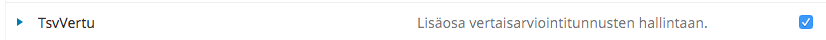

# Vertaisarviointitunnus

Vertaisarviointitunnus tulee esittää avoimen julkaisemisen palveluissa seuraavasti
- Journal.fi-palvelussa jokaisen vertaisarvioidun artikkelin yhteydessä sekä lehden esittelysivulla.
- Edition.fi-palvelussa jokaisen vertaisarvioidun kirjan yhteydessä sekä julkaisijan esittelysivulla.

_Tunnuksen esittämistä muissa paikoissa, kuten kaikilla sivuilla näkyvässä sivupalkissa, tulee välttää_.

## Vertaisarviointitunnus esittelysivulla

Vertaisarviointitunnusta koskeva kuvaus lisätään julkaisijan tai lehden esittelyyn. Edition.fi-palvelussa on keskeistä mainita, jos tunnus koskee jotain tiettyä julkaisijan sarjaa.

- Journal.fi-palvelussa _Tietoa julkaisusta_. **Asetukset => Julkaisu => Tunnuslaatikko => Tietoa julkaisusta**. **Inställningar => Tidskrift => Redaktionsruta => Om tidskriften. Settings => Journal => Masthead => About the Journal.**
- Edition.fi-palvelussa _Tietoa julkaisijasta_. **Asetukset => Julkaisija => Tunnuslaatikko => Tietoa julkaisijasta**. **Inställningar => Press => Redaktionsruta => Om pressen. Settings => Press => Masthead => About the Press.**

## Malliteksti

> **Vertaisarviointi** 
> Käytämme Tieteellisten seurain valtuuskunnan (TSV) myöntämää vertaisarviointitunnusta. Olemme sitoutuneet noudattamaan tunnuksen käytölle asetettuja ehtoja sekä edistämään omassa toiminnassamme Suomen tiedekustantajien liiton vertaisarviointiohjeen ja Tutkimuseettisen neuvottelukunnan Hyvä tieteellinen käytäntö -ohjeen mukaisia periaatteita.
> 

Logoon on hyvä lisätä linkki haluttuun kieliversioon: 
* [https://www.tsv.fi/fi/palvelut/tunnus](https://www.tsv.fi/fi/palvelut/tunnus)
* [https://www.tsv.fi/en/services/label-for-peer-reviewed-scholarly-publications](https://www.tsv.fi/en/services/label-for-peer-reviewed-scholarly-publications)
* [https://www.tsv.fi/sv/tjanster/marke-for-kollegialt-granskade-vetenskapspublikationer](https://www.tsv.fi/sv/tjanster/marke-for-kollegialt-granskade-vetenskapspublikationer)

Tunnuksen kuva löytyy sopivassa koossa osoitteesta [https://journal.fi/plugins/generic/tsvVertu/images/prlabel-large.jpg](https://journal.fi/plugins/generic/tsvVertu/images/prlabel-large.jpg).

Vertaisarviointitunnusta koskevan tekstin lisäksi sivustolla tulee kuvata myös tarkemmin julkaisijan vertaisarviointiprosessi. Mikäli julkaisijalla ei ole vielä sopivaa esittelytekstiä, kannattaa ottaa mallia muiden suomalaisten tiedejulkaisijoiden kuvauksista. Katso esimerkiksi [Vertaisarviointiprosessi Työväen historian ja perinteen tutkimuksen seuran julkaisuissa](http://www.thpts.fi/julkaisut/vertaisarviointiprosessi-tyovaen-historian-ja-perinteen-tutkimuksen-seuran-thpts-julkaisuissa/).

## Vertaisarviointitunnuksen lisääminen artikkeleihin ja kirjoihin

### TsvVertu-lisäosan aktivointi

Tunnuksen lisääminen yksittäisiin artikkeleihin tai kirjoihin onnistuu erillisen lisäosan avulla. Lisäosa kytketään päälle kohdasta **Asetukset => Verkkosivusto => Lisäosat / Inställningar => Webbplats => Plugins / Settings => Website => Plugins**.

Etsi luettelosta “TsvVertu” ja aktivoi se klikkaamalla lisäosan perässä oleva valintalaatikko.

### Tunnuksen liittäminen uusiin artikkeleihin ja kirjoihin

Vertaisarviointitunnus liitetään artikkeleihin tai kirjoihin tuotantovaiheessa. Liittäminen tapahtuu aina artikkelikohtaisesti tai kirjakohtaisesti ja tunnuksen liittävä toimittaja vastaa siitä, että kyseinen julkaisu on arvioitu tunnukseen liittyvien vaatimusten mukaisesti.

Avaa haluttu artikkeli tai kirja kohdasta **Käsikirjoitukset / Bidrag / Submissions** ja valitse välilehti **Julkaiseminen / Publikation / Publication**

- Journal.fi-palvelussa valitse avautuvasta näkymästä kohta **Numero / Nummer / Number** ja valitse lomakkeen alaosasta tunnuksen lisäämistä koskeva valinta ja tallenna tiedot.
- Edition.fi-palvelussa valitse avautuvasta näkymästä kohta **Luettelomerkintä / Metadata / Catalog Entry** ja valitse lomakkeen alaosasta tunnuksen lisäämistä koskeva valinta ja tallenna tiedot.

Kun artikkeli tai kirja on julkaistu, vertaisarviointitunnus näkyy abstraktisivulla sekä artikkeleiden tapauksessa myös sisällysluettelossa.

Mikäli lisäät tunnusta jo julkaistuun artikkeliin tai kirjaan, tulee sen julkaisu ensin perua. Tämän jälkeen kuvailutietoja voi muokata ja muokkauksen jälkeen voi julkaista uudelleen.

### Tunnuksen liittäminen vanhoihin artikkeleihin ja kirjoihin

Mikäli lisättäviä tunnuksia vanhoihin artikkeleihin tai kirjoihin on paljon, voi julkaisija ilmoittaa TSV:lle niiden artikkeleiden id-tunnisteet (numerosarja), joihin vertaisarvointitunnus liitetään. Id-tunnisteet näkyvät esimerkiksi kohdasta Käsikirjoitukset => Arkistot, jossa ne ovat listauksen ensimmäisessä sarakkeessa. 

**Tärkeää**. Vertaisarviointitunnus koskee ainoastaan niitä sisältöjä, jotka on julkaistu tunnuksen käyttöoikeuden alkamisen jälkeen. Julkaisijan käyttöoikeuden alkaminen selviää sivulta [Tunnusta käyttävät kirjankustantajat ja julkaisusarjat](https://tsv.fi/fi/palvelut/tunnus/tunnusta-kayttavat-kirjankustantajat-ja-julkaisusarjat).
